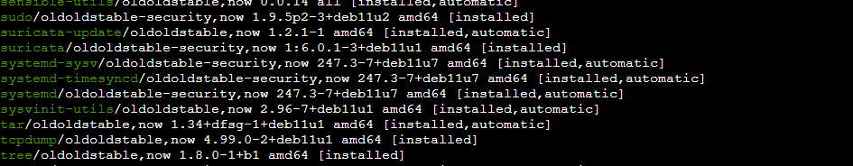

# Lab 01: Install Software in a Linux Distribution

> **Platform:** Qwiklabs  
> **Skill Area:** Linux, Security, Network Analysis  
> **Date Completed:** YYYY-MM-DD  
> **Difficulty:** Introductory  

---

## 📝 Overview
In this lab, you learned to manage applications on a Debian-based Linux system using the APT package manager.  
The lab focused on installing, uninstalling, and verifying network security applications **Suricata** and **tcpdump**.  
This experience is essential for security analysts managing Linux environments.

---

## 🎯 Objectives
- Ensure the APT package manager is installed.  
- Install the Suricata network analysis tool.  
- Uninstall Suricata and verify removal.  
- Install tcpdump and verify installation.  
- Reinstall Suricata and confirm both applications are installed.

---

## 🚀 What I Did

I started the lab by reviewing the **Lab Overview** to understand the objectives and environment:

I first confirmed that the **APT package manager** was installed and ready for use on the system:

Next, I installed **Suricata**, a network intrusion detection tool, using APT with elevated privileges (`sudo`). After installation, I verified that the application was running correctly:

  

I then uninstalled Suricata and confirmed it was removed from the system:

  

After that, I installed **tcpdump**, a command-line network traffic analyzer, and confirmed it appeared in the list of installed applications:

  

Finally, I reinstalled Suricata and checked that both Suricata and tcpdump were installed and ready for use:

---

✅ Results

Successfully installed and uninstalled Suricata.

Installed tcpdump and verified both tools were functioning.

Gained practical experience managing applications via APT on Debian-based Linux.

💡 Lessons Learned

How to use apt and sudo to manage applications.

Verifying software installation via command-line tools.

Importance of uninstalling and reinstalling software for testing purposes.

📜 Evidence

Completion screenshots in screenshots/ folder.

[Optional] PDF certificate if provided.

🔗 References

[Qwiklabs Lab Link](https://www.cloudskillsboost.google/focuses/43970221?parent=lti_session&parent=lti_session)
- Suricata Documentation: https://suricata.io/docs/  
- tcpdump Manual: https://www.tcpdump.org/manpages/tcpdump.1.html
