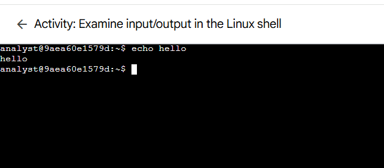
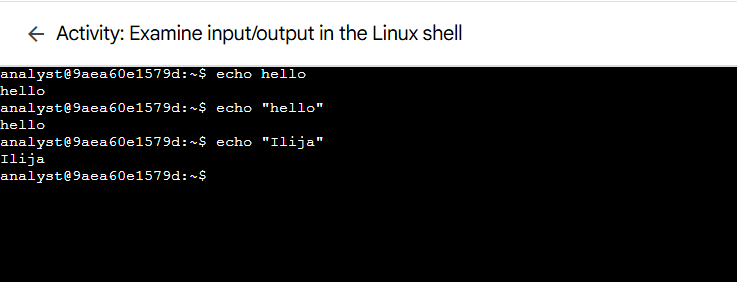
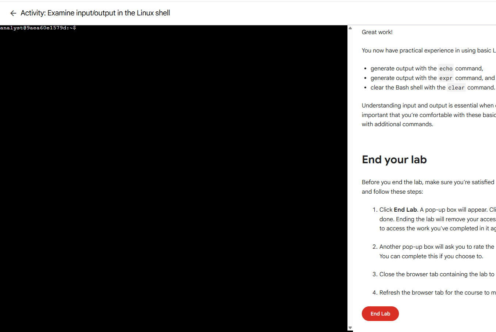

# Lab 02: Shell Input/Output Examples

> **Platform:** Qwiklabs  
> **Skill Area:** Linux, Command-Line Interface (CLI)  
> **Date Completed:** 21-09-2025
> **Difficulty:** Introductory  

---

## 📝 Overview
In this lab, you practiced using **basic shell input and output commands** in a Linux Bash environment.  
The lab focused on using `echo` to display messages, `expr` for simple arithmetic, and `clear` to manage the terminal workspace.  
These foundational skills are essential for security analysts interacting with Linux systems via the CLI.

---

## 🎯 Objectives
- Use `echo` to display text and messages.  
- Perform arithmetic operations using `expr`.  
- Manage terminal workspace with the `clear` command.  
- Practice standard input and output in the Linux shell.  

---

## 🚀 What I Did

I first used the `echo` command to print a simple greeting to the terminal:

Next, I used `echo` to display my name or custom messages:

I then practiced performing basic arithmetic operations using `expr`:

.png)

Finally, I cleared the terminal screen using the `clear` command to tidy the workspace:

---

✅ Results

Successfully executed commands to print messages, perform arithmetic, and clear the terminal.

Gained hands-on experience with standard input and output in Linux.

💡 Lessons Learned

- Using `echo` to display messages in the shell.  
- Performing arithmetic calculations with `expr`.  
- Managing terminal workspace with `clear`.  
- Understanding how the shell handles input and output.

📜 Evidence

Completion screenshots in the `screenshots/` folder.

🔗 References

[Qwiklabs Lab Link](https://www.coursera.org/learn/linux-and-sql/ungradedLti/MFehT/activity-examine-input-and-output-in-the-shell)
