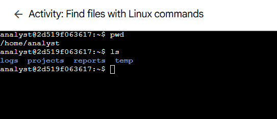
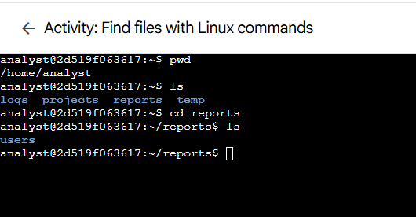
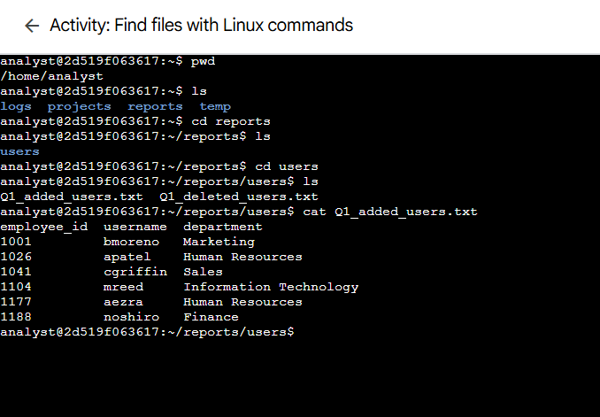
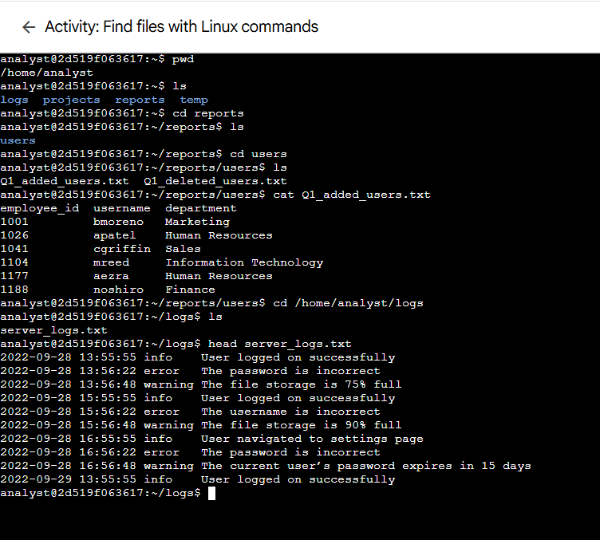
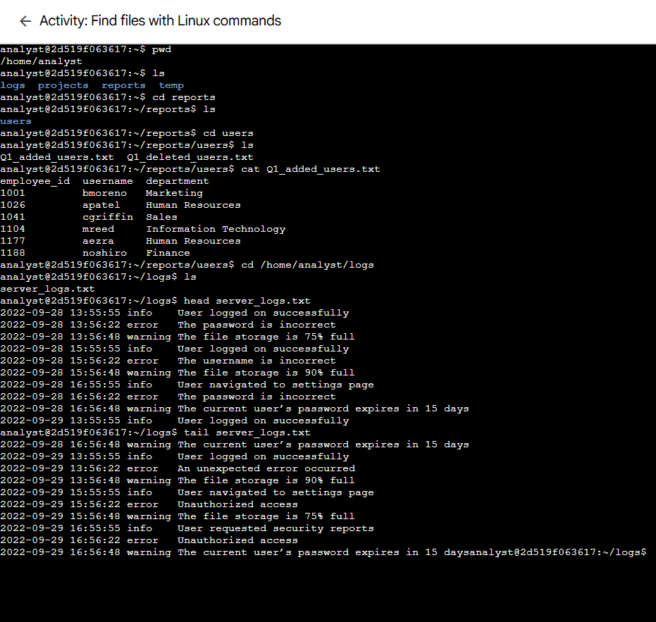

# Lab 03: Find Files with Linux Commands

> **Platform:** Qwiklabs  
> **Skill Area:** Linux, File Management, Security Analysis  
> **Date Completed:** 22-09-2025 
> **Difficulty:** Introductory  

---

## 📝 Overview
In this lab, you practiced navigating a Linux file system, locating files, and reading their contents using basic Bash commands.  
These are essential skills for security analysts investigating unauthorized access or analyzing logs in environments without a graphical interface.

---

## 🎯 Objectives
- Display the current working directory and its contents.  
- Navigate to the `reports` directory and list its subdirectories.  
- Locate and read the `Q1_added_users.txt` file in the `users` subdirectory.  
- Navigate to the `logs` directory, locate a log file, and view its first 10 lines.

---

## 🚀 What I Did

I began by checking the current working directory and listing its contents:

Next, I navigated to the **reports** directory, explored its contents, and identified the `users` subdirectory:

I then entered the `users` subdirectory, listed the files, and displayed the contents of `Q1_added_users.txt` to answer questions about employees and departments:

Then I moved to the `logs` directory, found the `server_logs.txt` file, and displayed its first 10 lines to check for warning messages:

Finally, I displayed the last 10 lines of the `server_logs.txt` file, and check for error messages:

---

## ✅ Results
- Successfully located and read files in various directories.  
- Identified information within `Q1_added_users.txt`.  
- Examined the first 10 lines of `server_logs.txt` for warning messages.

---

## 💡 Lessons Learned
- How to use `pwd`, `ls`, and `cd` to navigate Linux directories.  
- Viewing file contents with `cat` and `head`.  
- Efficiently locating and analyzing data from text files in a shell environment.

---

## 📜 Evidence
All completion screenshots are saved in the `screenshots/` folder:
- `01_pwd_and_ls.png`  
- `02_reports_ls.png`  
- `03_q1_added_users.png`  
- `04_server_logs_head.png`

---

## 🔗 References
- [Qwiklabs Lab Link](https://www.coursera.org/learn/linux-and-sql/ungradedLti/MFehT/activity-examine-input-and-output-in-the-shell)  
- Linux `ls` command manual: <https://man7.org/linux/man-pages/man1/ls.1.html>  
- Linux `head` command manual: <https://man7.org/linux/man-pages/man1/head.1.html>
