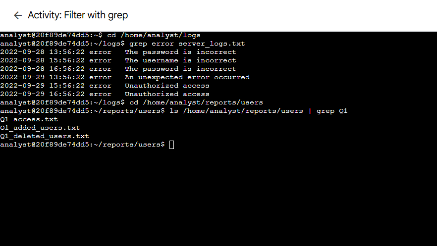
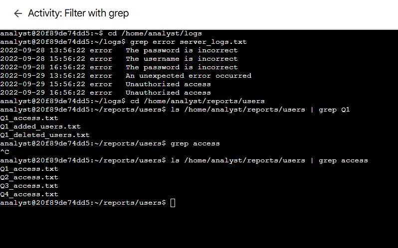
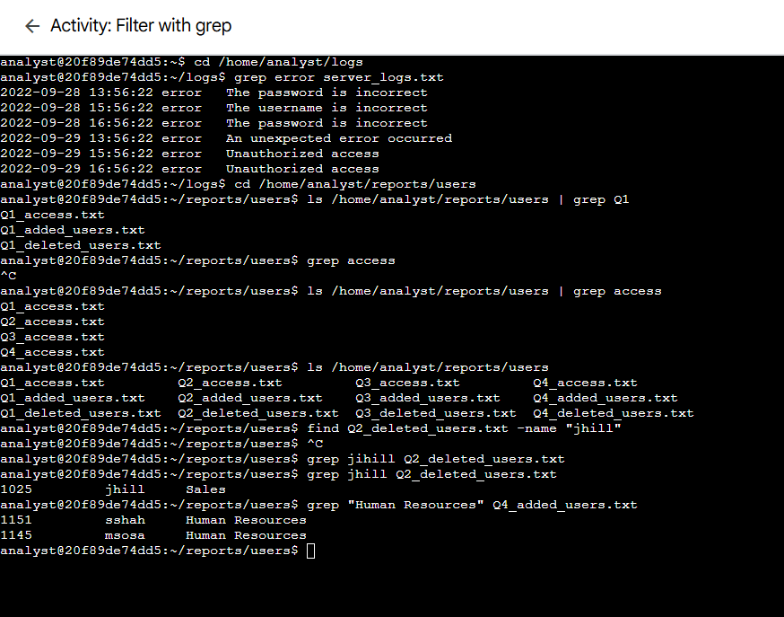

# Lab 04: Filter with grep

> **Platform:** Qwiklabs  
> **Skill Area:** Linux, Command Line, Text Processing  
> **Date Completed:** 22-09-2025
> **Difficulty:** Introductory  

---

## 📝 Overview
In this lab, I practiced using the **`grep` command** and **piping** in Linux to filter information from log and user data files.  
These skills are critical for security analysts when analyzing system logs, searching user reports, or filtering data efficiently from the command line without relying on graphical tools.

---

## 🎯 Objectives
- Use `grep` to locate error messages in server logs.  
- Pipe `ls` output into `grep` to filter file names by specific strings.  
- Search user data files for specific usernames.  
- Identify users in certain departments by searching with multi-word strings.  

---

## 🚀 What I Did

I began by exploring the **Lab Overview** and then moved step by step through different search and filter tasks.

### 🔎 Searching for Error Messages
I navigated into the `logs` directory and filtered the `server_logs.txt` file for error entries:  

---

### 📂 Finding Files Containing Specific Strings
Inside the `reports/users` directory, I piped `ls` output into `grep` to identify files containing `Q1` and `access` in their names:  

  

---

### 👤 Searching Inside User Files
Finally, I searched for usernames and department assignments directly within user files.  
For example, I confirmed that the user **`jhill`** appeared in the deleted users list, and I also identified employees added to the **Human Resources** department in Q4:  

---

## ✅ Results
- Successfully used `grep` to filter logs and user data.  
- Learned to combine commands with pipes (`|`) for efficient searches.  
- Verified both usernames and departmental assignments from text files.  

---

## 💡 Lessons Learned
- `grep` is essential for quickly finding specific data within files.  
- Piping (`|`) allows chaining commands to build powerful workflows.  
- Quoting multi-word search strings (`"Human Resources"`) ensures accurate matches.  

---

## 📜 Evidence
Completion screenshots are available in the `screenshots/` folder:  
- `01_grep_errors.png`  
- `02_grep_q1.png`  
- `03_grep_access.png`  
- `04_grep_users.png`  

---

## 🔗 References
- [Qwiklabs Lab Link](https://www.coursera.org/learn/linux-and-sql/ungradedLti/MFehT/activity-examine-input-and-output-in-the-shell)  
- GNU `grep` Manual: https://www.gnu.org/software/grep/manual/  
- Linux Pipes Documentation: https://tldp.org/LDP/abs/html/io-redirection.html  

---
