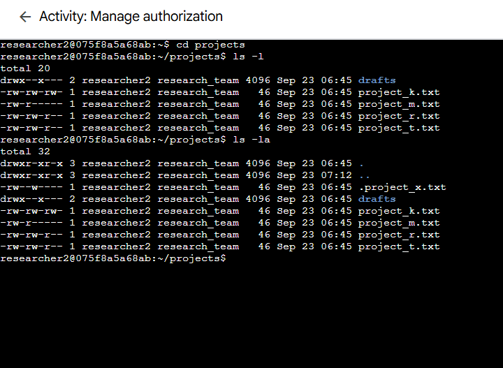

# Lab 06: Manage Authorization

> **Platform:** Qwiklabs  
> **Skill Area:** Linux, Security, File Permissions  
> **Date Completed:** 23-09-2025  
> **Difficulty:** Introductory  

---

## 📝 Overview
In this lab, I explored how to configure **authorization** in a Linux environment.  
I examined and modified **file and directory permissions**, checked ownership, and secured sensitive files.  
As a security analyst, proper authorization is key to ensuring that only intended users and groups have access to critical resources.

---

## 🎯 Objectives
- List and analyze permissions of files and directories.  
- Identify files with **incorrect permissions** and fix them.  
- Secure **hidden files** by adjusting read/write access.  
- Modify directory permissions to restrict unauthorized access.  

---

## 🚀 What I Did

 I navigated to the `projects` directory and listed file details with permissions:  

  

I then identified files with incorrect permissions. For example,  
`project_k.txt` incorrectly granted **write permissions** to `others`.  
I removed that permission using:  

 

I also restricted project_m.txt so only the user could read/write it:

 

Next, I checked the hidden file .project_x.txt.
It allowed write access, which was not authorized.
I corrected it so both user and group can only read:

 

Finally, I modified the drafts directory so that only researcher2 could execute/access it,
removing group execute permissions:

  

✅ Results

Verified ownership and permissions of all files and directories.

Removed unauthorized write access from files.

Restricted a hidden file to read-only.

Secured the drafts directory to user-only access.

💡 Lessons Learned

How to use ls -la to check permissions of visible and hidden files.

How to use chmod effectively for user (u), group (g), and others (o).

Importance of controlling directory execute (x) permissions to restrict access.

📜 Evidence

Completion screenshots in the screenshots/ folder:

🔗 References

Qwiklabs Lab Link:
https://www.cloudskillsboost.google/focuses/44029949?parent=lti_session&parent=lti_session
