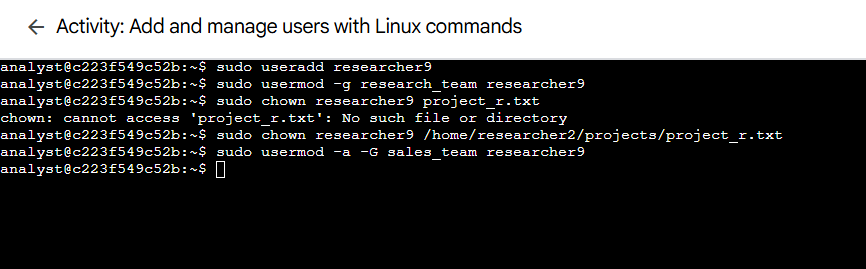

# Lab 07: Add and Manage Users with Linux Commands

> **Platform:** Qwiklabs  
> **Skill Area:** Linux, Security, Authentication & User Management  
> **Date Completed:** 23-09-2025
> **Difficulty:** Introductory  

---

## 📝 Overview
In this lab, I practiced managing **users and groups** in Linux using commands such as `useradd`, `usermod`, `chown`, and `userdel`.  
This involved adding a new employee to the system, assigning them file ownership, updating group memberships, and eventually deleting the user and their group.  
As a security analyst, managing users is part of enforcing **authentication and access controls**.

---

## 🎯 Objectives
- Create a new user account and assign a primary group.  
- Transfer file ownership to a new user.  
- Add a user to a secondary group.  
- Remove a user and their associated group when they leave the organization.  

---

## 🚀 What I Did

### Task 1: Add a new user
I created a new user **`researcher9`** and added them to the `research_team` group as their primary group:

sudo useradd researcher9
sudo usermod -g research_team researcher9

### Task 2: I assigned Ownership
I assigned ownership of the project_r.txt file to researcher9 using chown.
This ensured the new employee was responsible for their project file:

sudo chown researcher9 /home/researcher2/projects/project_r.txt

 

Task 3: Add the user to a secondary group

After researcher9’s role expanded, I added them to the sales_team group while keeping research_team as the primary group:

sudo usermod -a -G sales_team researcher9

Task 4: Delete a user

When researcher9 left the company, I removed their account with userdel, then deleted the associated empty group:

sudo userdel researcher9
sudo groupdel researcher9

The expected message confirmed that the group was not removed automatically:
Userdel: Group researcher9 not removed because it is not the primary group of user researcher9.

 

✅ Results

Successfully added a new user and managed their primary and secondary groups.

Assigned file ownership to ensure accountability.

Removed users and cleaned up groups to maintain a secure, minimal system.

💡 Lessons Learned

*useradd, usermod, and userdel are critical tools for Linux user management.

*File ownership can be reassigned with chown to reflect responsibility.

*Always clean up unused groups (groupdel) to keep the system organized.

*This workflow reinforces the principle of proper authentication and lifecycle management for users.

📜 Evidence

Completion screenshots in the screenshots/ folder:

🔗 References

Qwiklabs Lab Link:
https://www.cloudskillsboost.google/focuses/44030724?parent=lti_session&parent=lti_session
