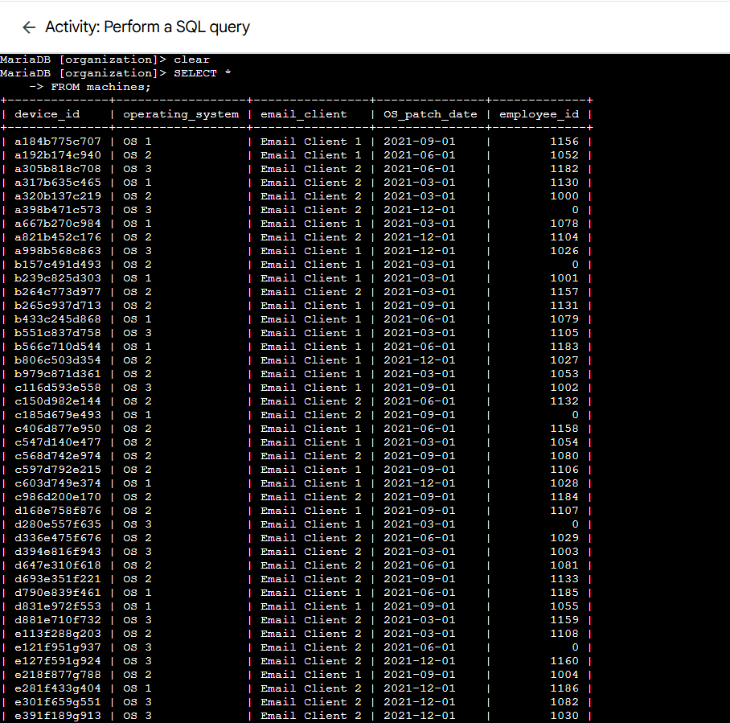
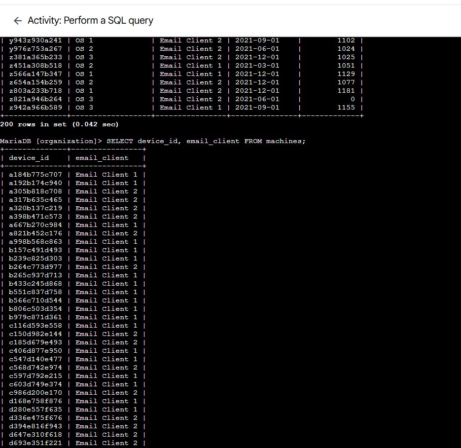
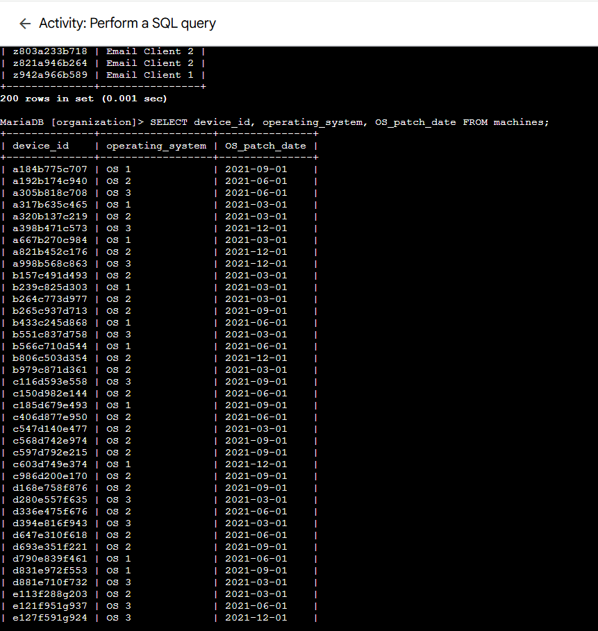
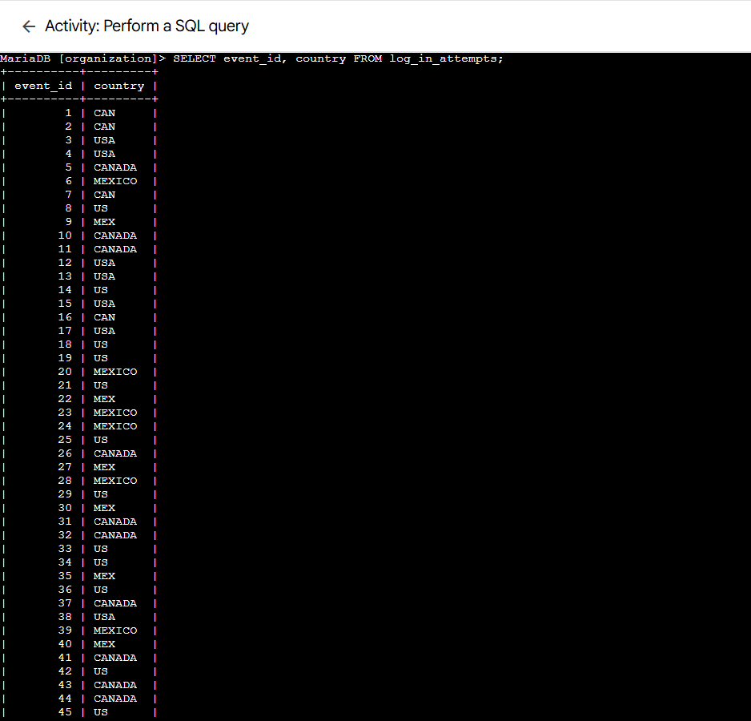
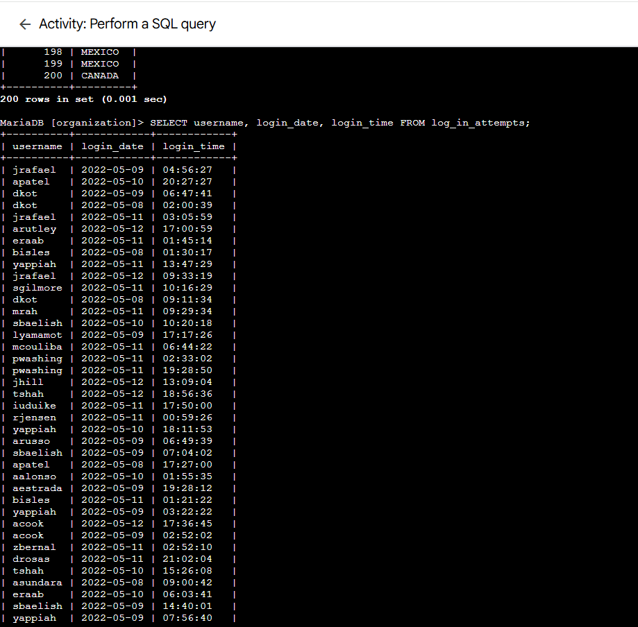
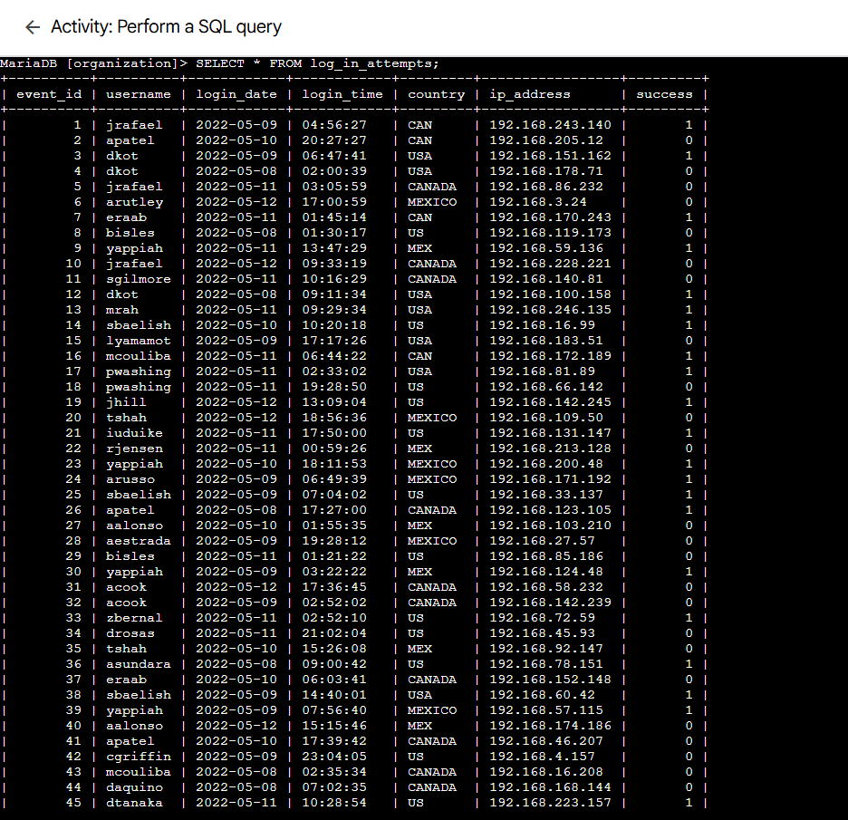
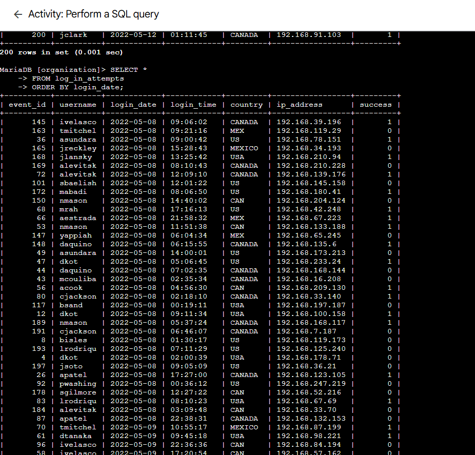
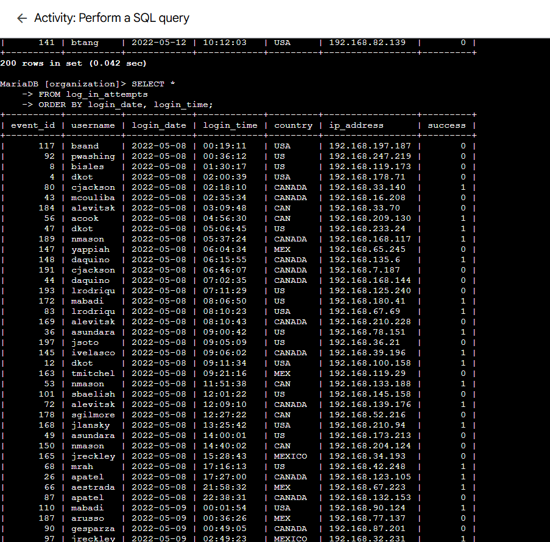

# Lab 09: Perform a SQL Query

> **Platform:** Qwiklabs  
> **Skill Area:** SQL, Databases, Security Analysis  
> **Date Completed:** 23-09-2025  
> **Difficulty:** Introductory  

---

## 📝 Overview
In this lab, I practiced using **SQL queries** to retrieve, filter, and order information from relational database tables.  
As a security analyst, querying databases helps identify vulnerable systems, investigate login activities, and detect suspicious behavior.  

---

## 🎯 Objectives
- Use `SELECT` and `FROM` to retrieve data from tables.  
- Retrieve specific columns from a database table.  
- Use the `*` wildcard to select all data from a table.  
- Apply `ORDER BY` to sort query results by date and time.  
- Analyze login attempts for unusual or suspicious activity.  

---

## 🚀 What I Did

### Task 1: Retrieve Employee Device Data
* I retrieved all device records from the `machines` table:

SELECT * 
FROM machines;
I selected specific columns (device_id and email_client) to focus on email client usage:

SELECT device_id, email_client 
FROM machines;

I selected operating system details and patch dates:

SELECT device_id, operating_system, OS_patch_date 
FROM machines;

### Task 2: Investigate Login Activity
I investigated login locations:

SELECT event_id, country 
FROM log_in_attempts;

I checked login attempts outside normal hours by selecting usernames, dates, and times:

SELECT username, login_date, login_time 
FROM log_in_attempts;

Finally, I displayed all login attempt data:

SELECT * 
FROM log_in_attempts;

### Task 3: Order Login Attempts Data
I sorted login attempts by date:

SELECT * 
FROM log_in_attempts
ORDER BY login_date;

I further ordered the results by login time:

SELECT * 
FROM log_in_attempts
ORDER BY login_date, login_time;

✅ Results

Successfully queried all device and login attempt records.

Retrieved targeted data using SELECT with specific columns.

Verified unusual login activity outside expected regions.

Ordered results by both date and time for accurate analysis.

💡 Lessons Learned

SELECT * retrieves all data, while specifying columns improves focus.

ORDER BY helps organize large datasets for investigation.

SQL queries are essential for identifying system vulnerabilities and security incidents.

📜 Evidence
Screenshots for each task are stored in the screenshots/ folder.

🔗 References
Qwiklabs Lab Link:
https://www.cloudskillsboost.google/focuses/44042687?parent=lti_session&parent=lti_session
