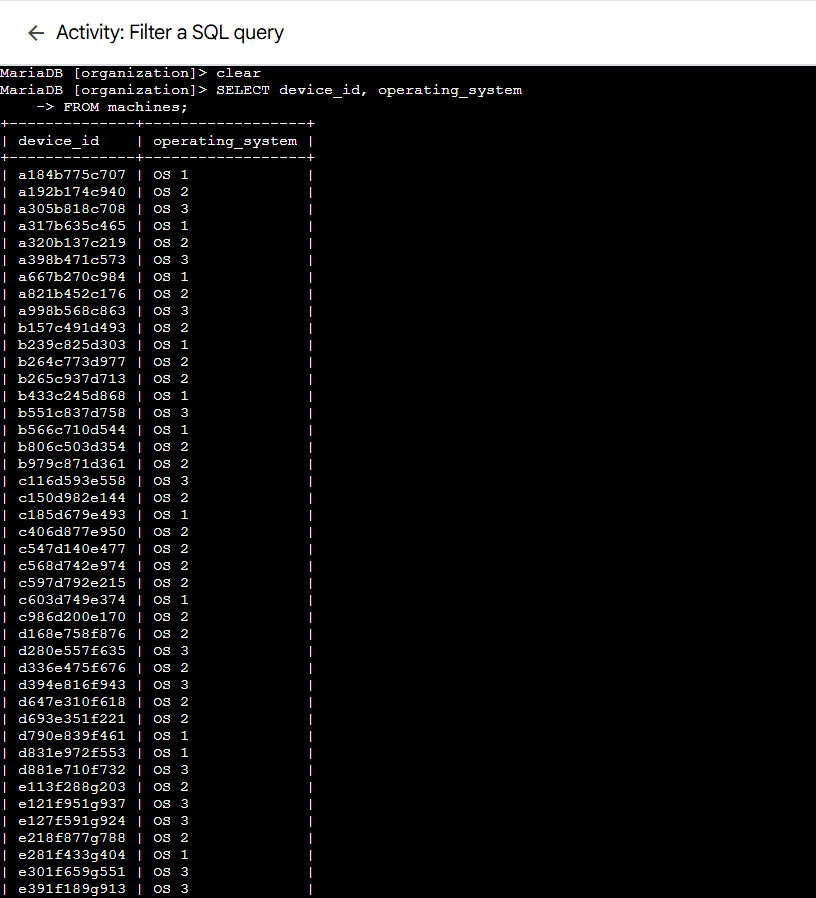

# Lab 10: Filter a SQL Query

> **Platform:** Qwiklabs  
> **Skill Area:** SQL, Databases, Security Analysis, Query Filtering  
> **Date Completed:** 24-09-2025  
> **Difficulty:** Introductory  

---

## 📝 Overview
In this lab, I practiced **filtering SQL queries** in MariaDB to retrieve specific pieces of data.  
As a security analyst, being able to query and filter records is essential for quickly finding security-related information, managing updates, and identifying affected machines or employees.

---

## 🎯 Objectives
- Use `SELECT` to retrieve specific columns from tables.  
- Apply `WHERE` to filter results by conditions.  
- Use the `LIKE` operator to match patterns.  
- Identify employee machines by office location.  

---

## 🚀 What I Did

### Task 1: List all organization machines
I retrieved the list of all machines and their operating systems.  

Query:  

SELECT device_id, operating_system
FROM machines;
Answer: 200 rows returned

### Task 2: Retrieve a list of the machines with OS 2
I filtered the machines table to display only machines with operating system OS 2.

Query:

SELECT device_id, operating_system
FROM machines 
WHERE operating_system = 'OS 2';

### Task 3.1: List employees in the Finance department
I queried the employees table to retrieve all employees in Finance.

Query:

SELECT * 
FROM employees 
WHERE department = 'Finance';

### Task 3.2: List employees in the Sales department
I modified the previous query to return Sales employees.

Query:

SELECT * 
FROM employees 
WHERE department = 'Sales';

### Task 4.1: Identify employee using South-109 office
I filtered the employees table for the South-109 office.

Query:

SELECT * 
FROM employees 
WHERE office = 'South-109';

### Task 4.2: List all employees in the South building
I used the LIKE operator to return all employees in the South building.

Query:

SELECT * 
FROM employees 
WHERE office LIKE 'South-%';

✅ Results

Used SELECT to extract only necessary columns.

Applied WHERE filters to return precise results.

Combined filtering with LIKE to query office locations.

Identified machines and employees by OS and department.

💡 Lessons Learned

SQL filtering with WHERE enables efficient data retrieval.

LIKE is useful for pattern-based filtering (e.g., all offices in a building).

Proper filtering helps security analysts quickly isolate affected systems.

📜 Evidence
Screenshots are stored in the screenshots/ folder for each task and subtask.

🔗 References
Qwiklabs Lab Link:
https://www.cloudskillsboost.google/focuses/44043504?parent=lti_session&parent=lti_session