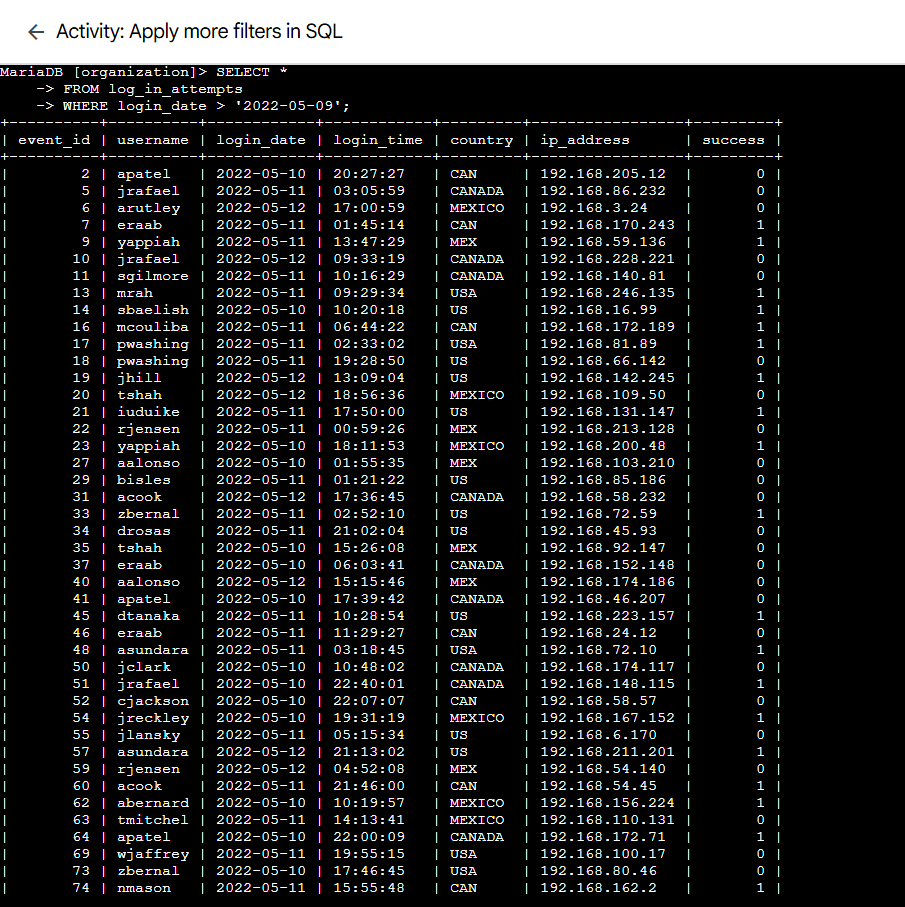

# Lab 11: Apply More Filters in SQL

> **Platform:** Qwiklabs  
> **Skill Area:** SQL, Databases, Security Analysis  
> **Date Completed:** 24-09-2025  
> **Difficulty:** Introductory  

---

## 📝 Overview
In this lab, I practiced applying **filters with operators in SQL** to retrieve specific records from a database.  
As a security analyst, these filtering skills are crucial when investigating incidents by narrowing down queries to specific **dates, times, and IDs**.  

---

## 🎯 Objectives
- Use comparison operators (`=`, `>`, `<`, `>=`, `<=`, `<>`) in SQL queries.  
- Filter results within a date range using `BETWEEN` and `AND`.  
- Retrieve results based on time values.  
- Apply filters using numeric values such as event IDs.  

---

## 🚀 What I Did

### Task 1: Retrieve Login Attempts After a Certain Date
* I wrote a query to select login attempts **after `2022-05-09`**:

sql
SELECT * 
FROM log_in_attempts 
WHERE login_date > '2022-05-09';

Then, I modified the query to include attempts on or after 2022-05-09:

sql
SELECT * 
FROM log_in_attempts 
WHERE login_date >= '2022-05-09';

### Task 2: Retrieve Logins in a Date Range
I filtered login attempts between 2022-05-09 and 2022-05-11:

sql
SELECT * 
FROM log_in_attempts 
WHERE login_date BETWEEN '2022-05-09' AND '2022-05-11';

### Task 3: Investigate Logins at Certain Times
I queried all logins before 07:00:00 to find early logins:

sql
SELECT * 
FROM log_in_attempts 
WHERE login_time < '07:00:00';

Then I restricted the query to logins between 06:00:00 and 07:00:00:

sql
SELECT * 
FROM log_in_attempts 
WHERE login_time BETWEEN '06:00:00' AND '07:00:00';

### Task 4: Investigate Logins by Event ID
I retrieved all login attempts with event_id >= 100:

sql
SELECT event_id, username, login_date
FROM log_in_attempts 
WHERE event_id >= 100;

Then I limited results to event IDs between 100 and 150:

sql
SELECT event_id, username, login_date
FROM log_in_attempts 
WHERE event_id BETWEEN 100 AND 150;

✅ Results
Retrieved login attempts filtered by specific dates and times.

Applied operators for equality, ranges, and comparisons.

Practiced filtering with numeric event IDs.

💡 Lessons Learned
> / >= help to include or exclude boundary dates.

BETWEEN ... AND ... is ideal for date and time ranges.

Time filtering is as important as date filtering for identifying suspicious logins.

Numeric filters (like event IDs) can be used to isolate smaller segments of data for analysis.

📜 Evidence
All screenshots are saved in the screenshots/ folder with names per task and subtask.

🔗 References
Qwiklabs Lab Link:
[Activity: Apply More Filters in SQL](https://www.cloudskillsboost.google/focuses/44051375?parent=lti_session&parent=lti_session)
