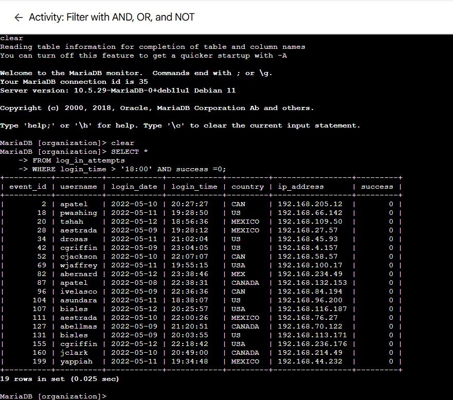
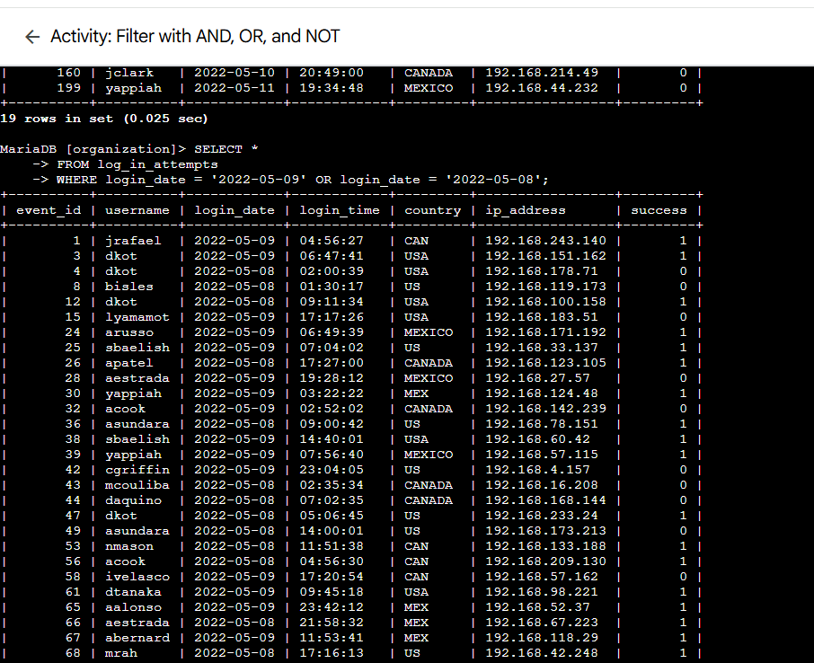
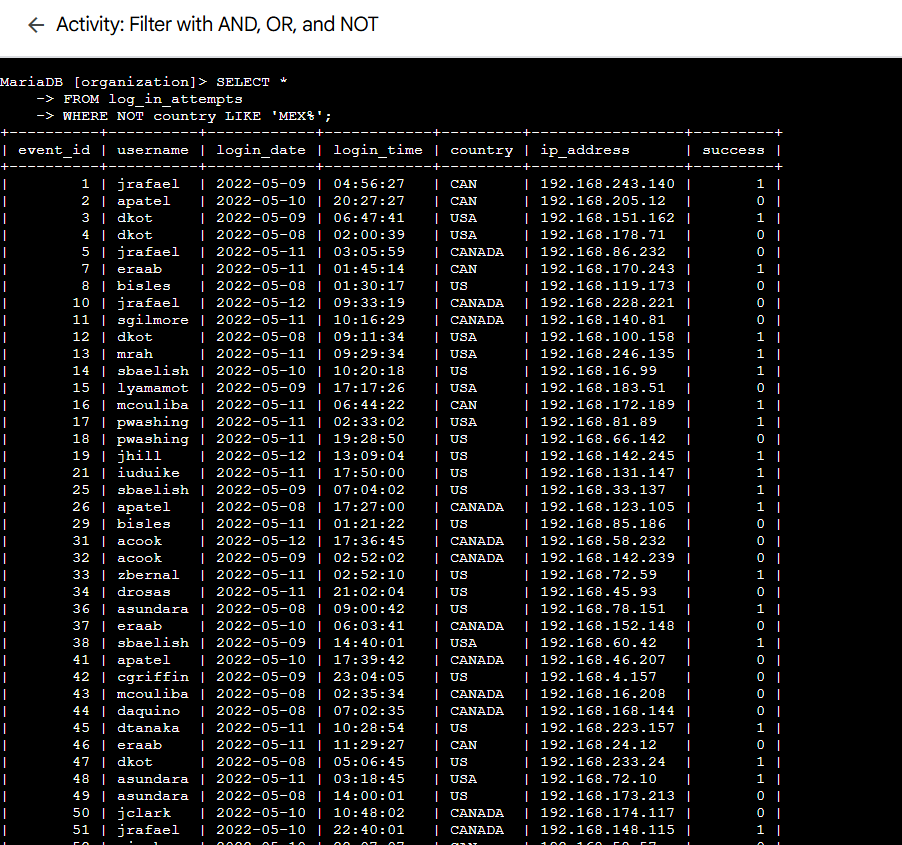
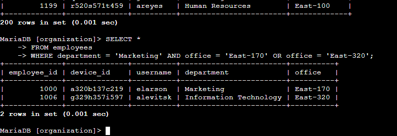
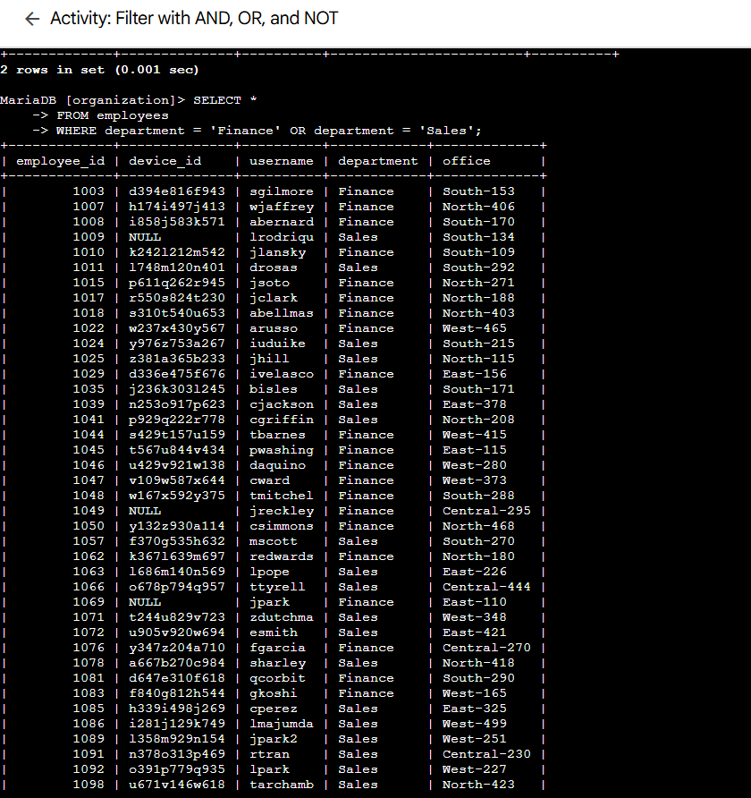
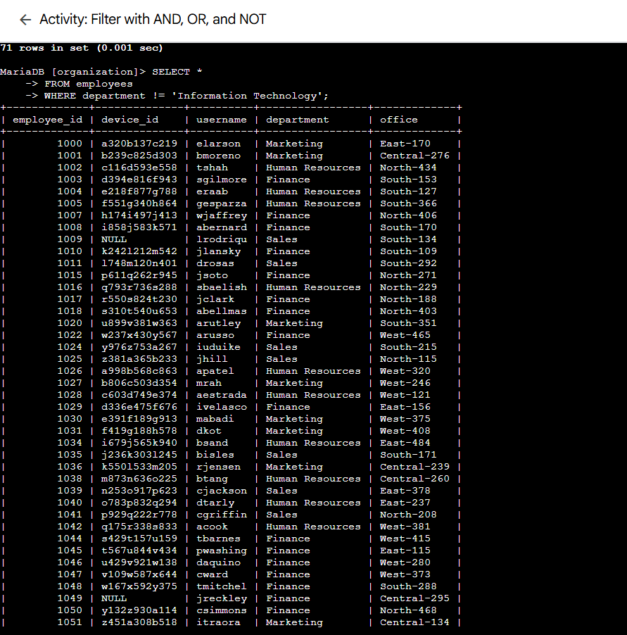

# Lab 12: Activity – Filter with AND, OR, and NOT

> **Platform:** Qwiklabs  
> **Skill Area:** SQL, Databases, Security Analysis, Query Filtering  
> **Date Completed:** 24-09-2025  
> **Difficulty:** Introductory  

---
## Overview

In this lab, I’ll practice filtering SQL queries using `AND`, `OR`, and `NOT` operators to retrieve specific data from a database.  
This includes filtering login attempts, employees, and department records.

---

## Task 1: Retrieve after hours failed login attempts  
Use the `AND` operator to get failed login attempts after `18:00`.

sql
SELECT *
FROM log_in_attempts
WHERE login_time > '18:00' AND success = 0;

### Task 2: Retrieve login attempts on specific dates
Use the OR operator to get login attempts on 2022-05-08 or 2022-05-09.

sql
SELECT * 
FROM log_in_attempts 
WHERE login_date = '2022-05-08' OR login_date = '2022-05-09';

### Task 3: Retrieve login attempts outside of Mexico
Use the NOT and LIKE operators to exclude logins from Mexico.

sql
SELECT * 
FROM log_in_attempts
WHERE NOT country LIKE 'MEX%';

### Task 4: Retrieve employees in Marketing
Filter employees in the Marketing department located in the East building.

sql
SELECT *
FROM employees
WHERE department = 'Marketing' AND office LIKE 'East-%';

### Task 5: Retrieve employees in Finance or Sales
Use the OR operator to return employees from Finance or Sales.

sql
SELECT *
FROM employees
WHERE department = 'Finance' OR department = 'Sales';

### Task 6: Retrieve all employees not in IT
Use the NOT operator to exclude employees in Information Technology.

sql
SELECT *
FROM employees
WHERE NOT department = 'Information Technology';

✅ Conclusion
In this lab, I practiced using:

AND, OR, and NOT operators

LIKE for pattern matching

📜 Evidence
All screenshots are saved in the screenshots/ folder with names per task and subtask.

🔗 References
Qwiklabs Lab Link:
https://www.cloudskillsboost.google/focuses/44052295?parent=lti_session&parent=lti_session