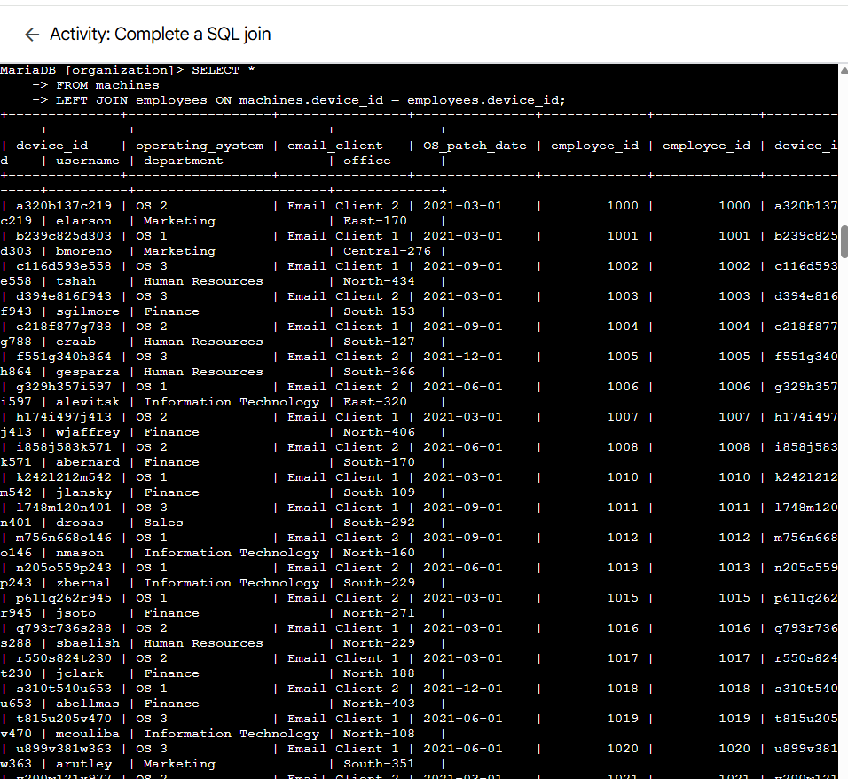
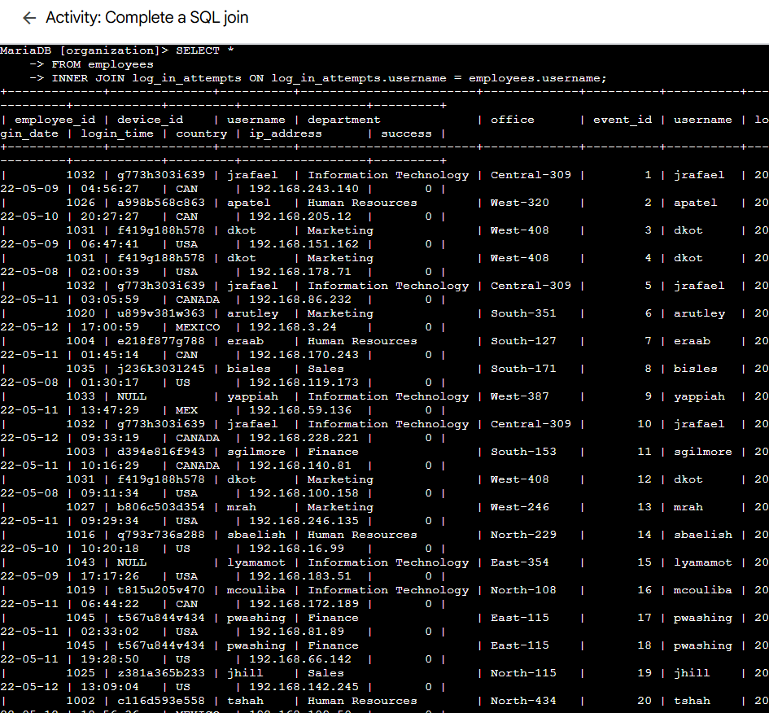

# Lab 13: Activity – Complete a SQL Join

> **Platform:** Qwiklabs  
> **Skill Area:** SQL, Databases, Security Analysis, Query Filtering  
> **Date Completed:** 24-09-2025  
> **Difficulty:** Introductory  

---

## Overview
In this lab, I will practice performing SQL joins to connect data from multiple tables in a relational database.  
I will use `INNER JOIN`, `LEFT JOIN`, and `RIGHT JOIN` to combine tables and retrieve the required information.

---

## Task 1 – Match employees to their machines
Complete an **INNER JOIN** between the `machines` and `employees` tables using the `device_id` column.

SELECT * 
FROM machines 
INNER JOIN employees ON machines.device_id = employees.device_id;

### Task 2 – Return more data
Part A – LEFT JOIN
Retrieve all records from the machines table and their linked employees.

SELECT * 
FROM machines 
LEFT JOIN employees ON machines.device_id = employees.device_id;

Part B – RIGHT JOIN
Retrieve all records from the employees table and their linked machines.

SELECT * 
FROM machines 
RIGHT JOIN employees ON machines.device_id = employees.device_id;

### Task 3 – Retrieve login attempt data
Perform an INNER JOIN between the employees and log_in_attempts tables on the username column.

SELECT * 
FROM employees 
INNER JOIN log_in_attempts ON employees.username = log_in_attempts.username;

Conclusion
In this lab, I gained experience with SQL joins, including:

INNER JOIN to match data across tables

LEFT JOIN to include all rows from one table, with matching rows from another

RIGHT JOIN to include all rows from the other table, with matching rows from the first

📜 Evidence
All screenshots are saved in the screenshots/ folder with names per task and subtask.

🔗 References
Qwiklabs Lab Link:
https://www.cloudskillsboost.google/focuses/44060973?parent=lti_session&parent=lti_session