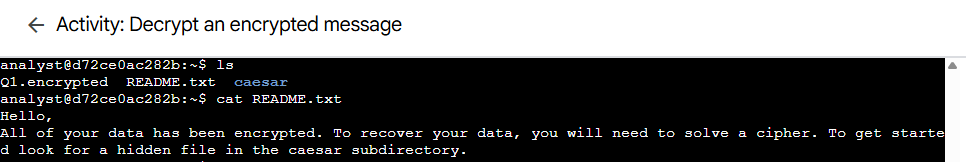
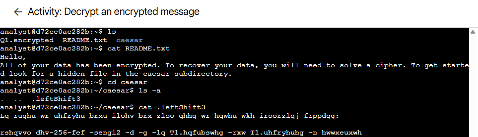
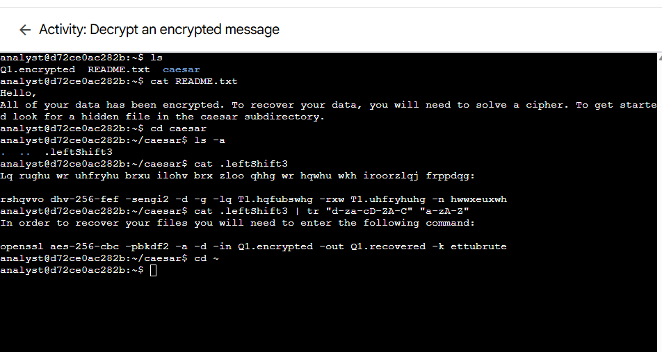
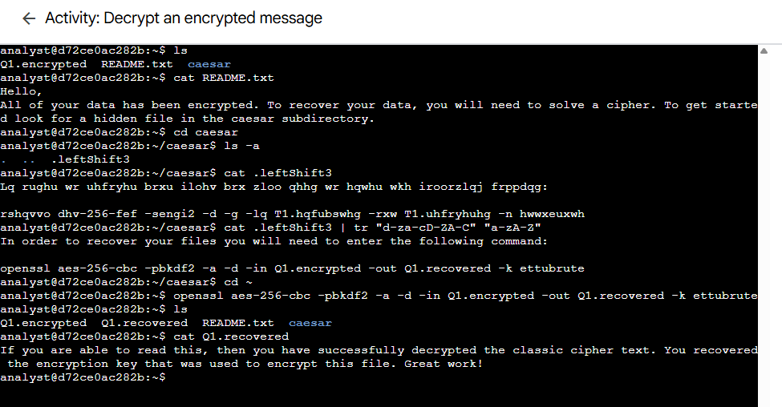

# Lab 14: File Exploration and Decryption Lab

Platform: Qwiklabs
Skill Area: Linux, Security, Command-Line Interface (CLI)
Date Completed: 08-10-2025
Difficulty: Intermediate

📝 Overview

In this lab, I practiced exploring directories, identifying hidden files, and decrypting data using both Caesar cipher and AES-256-CBC encryption methods.
The lab focused on using fundamental Linux commands such as ls, cat, and tr, as well as the openssl tool for cryptographic operations.

🎯 Objectives
Use ls and cat to explore and read files.
Identify and access hidden files in a directory.
Decrypt a message encrypted with a Caesar cipher.
Use OpenSSL to decrypt an AES-256 encrypted file.

🚀 What I Did
# Task 1 – Read the Contents of a File

I began in the home directory /home/analyst and listed all available files:

ls

The directory contained:

Q1.encrypted  README.txt  caesar

Next, I read the contents of the README.txt file to reveal further instructions:

cat README.txt

The file mentioned that a hidden file was located in the caesar directory.

# Task 2 – Find a Hidden File

I navigated into the caesar directory:

cd caesar

Then, I listed all files including hidden ones:

ls -a

Output:

.  ..  .leftShift3

I displayed the contents of the hidden file:

cat .leftShift3

The message appeared scrambled, encrypted with a Caesar cipher.
To decrypt it, I used the tr command:

cat .leftShift3 | tr "d-za-cD-ZA-C" "a-zA-Z"

The decrypted message revealed the command needed to decrypt the main file.
I then returned to the home directory:

cd ~

# Task 3 – Decrypt a File

Using the command revealed in the previous task, I decrypted the file Q1.encrypted:

openssl aes-256-cbc -pbkdf2 -a -d -in Q1.encrypted -out Q1.recovered -k ettubrute

After decryption, I verified the output file:

ls

A new file, Q1.recovered, appeared.
Finally, I viewed its contents:

cat Q1.recovered

✅ Results

Successfully located a hidden file, decrypted a Caesar cipher, and used OpenSSL to recover an encrypted file.
The decrypted message confirmed successful data recovery.

💡 Lessons Learned

How to navigate directories and reveal hidden files with ls -a.
Understanding and solving a Caesar cipher using the tr command.
Decrypting files securely with OpenSSL.
Strengthening command-line fluency in Linux.

📜 Evidence

All execution screenshots are available in the screenshots/ folder.

🔗 References

[Qwiklabs Lab Link](https://www.cloudskillsboost.google/focuses/44285708?parent=lti_session&parent=lti_session)
