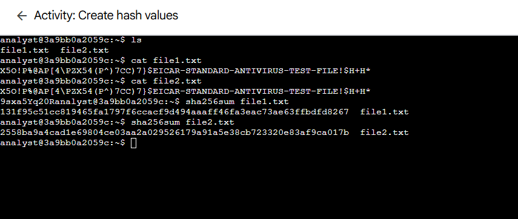
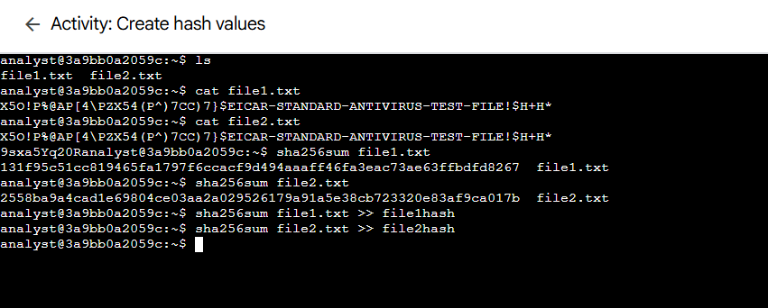
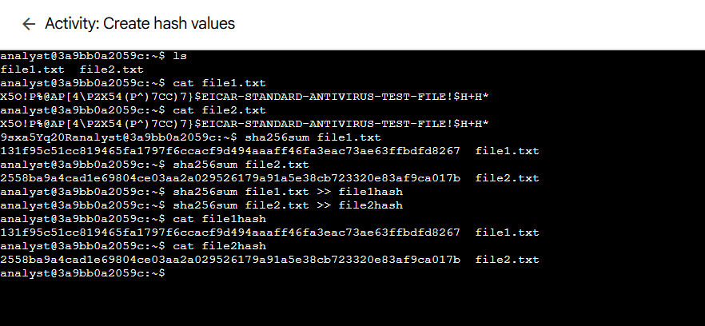
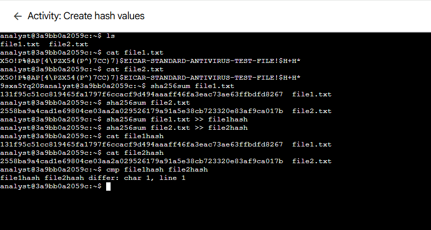

Lab 15: Create Hash Values

Platform: Qwiklabs
Skill Area: Linux, Cybersecurity, File Integrity
Date Completed: 10-10-2025
Difficulty: Introductory

📝 Overview

In this lab, I learned how to generate and compare SHA-256 hash values of files in Linux to determine if two files are identical or different.
Hashing is a fundamental security process for ensuring data integrity, file verification, and tamper detection.

🎯 Objectives

List the contents of the home directory.

View and compare the plain-text contents of two files.

Generate SHA-256 hash values for each file.

Compare the resulting hashes to determine whether the files differ.

🚀 What I Did
# Step 1 – List the Files

I started by listing the contents of my home directory to identify the files provided for hashing:

ls

Two files were present:

file1.txt  file2.txt

# Step 2 – View File Contents

Next, I examined the contents of each file to see if they looked identical or different in plain text:

cat file1.txt
cat file2.txt

At first glance, both files appeared almost identical, but even a single character difference can change a hash completely.

# Step 3 – Generate Hash Values

I computed the SHA-256 hash values for each file:

sha256sum file1.txt
sha256sum file2.txt

Each command output a long, unique hash string like this:

9b74c9897bac770ffc029102a200c5de...  file1.txt
3b5d5c3712955042212316173ccf37be...  file2.txt

# Step 4 – Compare the Hashes

Even though the text differences were minimal, the hash values were completely different, confirming that the files are not identical.

Hash functions are designed so that even one character change drastically alters the resulting hash — this property is known as the avalanche effect.

✅ Results

Successfully generated SHA-256 hashes for two files and confirmed that even minor file changes result in entirely different hash outputs.

💡 Lessons Learned

Hashing creates a unique digital fingerprint for a file.

SHA-256 is a one-way function — hashes cannot be reversed to retrieve the original content.

Comparing hashes is a reliable method for verifying file integrity.

Even a small data alteration produces a completely new hash value.

📜 Evidence

All command outputs and results are stored as screenshots in the screenshots/ folder.

🔗 References

Qwiklabs Lab Link