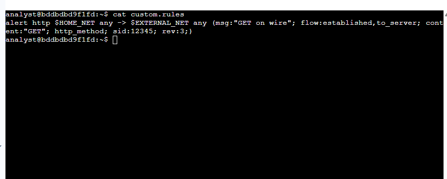
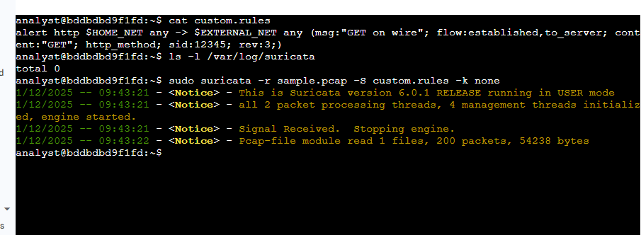
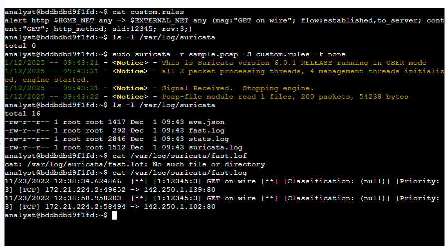
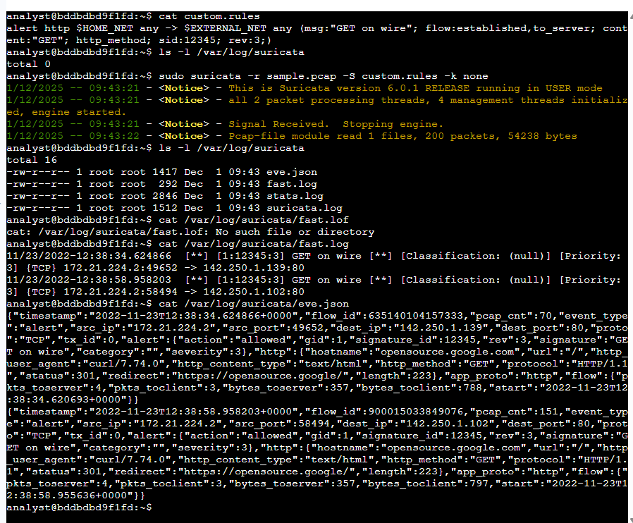
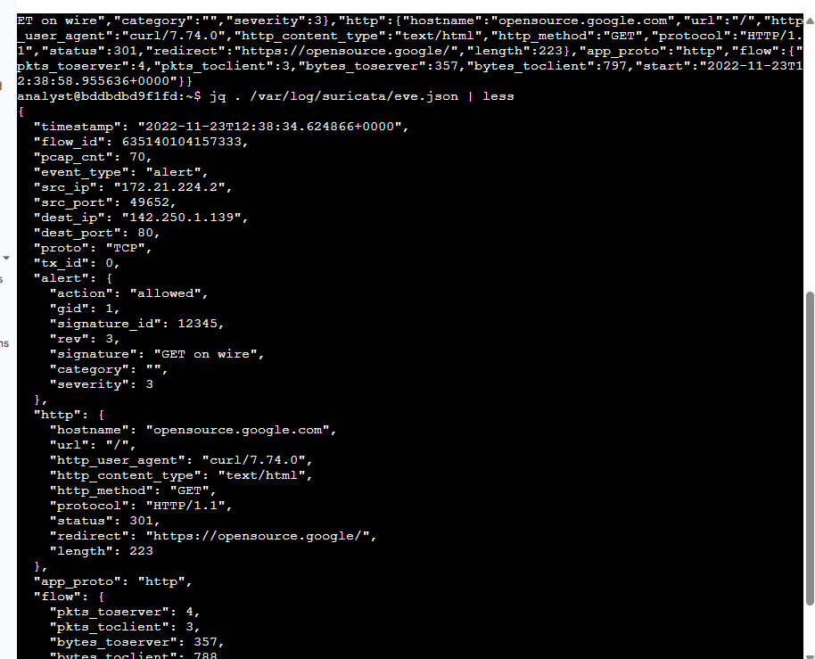
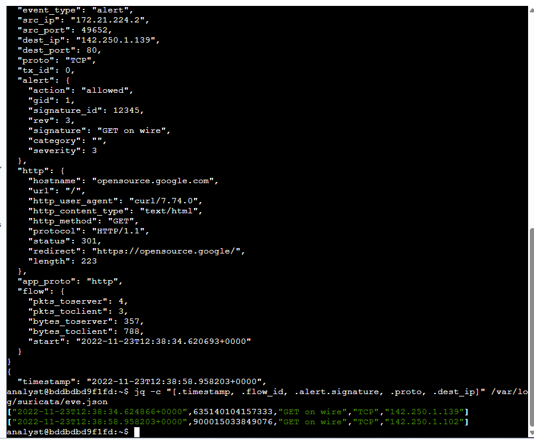

Lab 17: Configuring Suricata for Network Traffic Monitoring

Platform: Qwiklabs
Skill Area: Network Monitoring, Intrusion Detection Systems (IDS), Threat Hunting, Suricata Rules 
Date Completed: 01-12-2025 
Difficulty: Advanced

📝 Overview
As a security analyst, this lab required me to configure and use Suricata, a high-performance Network Intrusion Detection System (NIDS), to monitor network traffic from a sample packet capture file. I focused on creating and running custom rules to generate alerts, then examining the resulting logs in both the traditional fast.log and the detailed JSON-formatted eve.json files.

Through hands-on exercises, I learned how to:

Dissect the three core components of a Suricata rule: Action, Header, and Rule Options.

Execute Suricata against a sample.pcap file using custom rules.

Analyze the content of the fast.log file for quick alert summaries.

Utilize the jq command-line tool to parse and examine the detailed JSON output in the eve.json file.

Understand the concept of a network flow and use the unique flow_id to correlate events.

### 🗃️ Lab Files and Log Outputs

| File Name | Description | Purpose in Lab |
| :--- | :--- | :--- |
| **sample.pcap** | Packet capture file | Contains sample network traffic data used for testing rules. |
| **custom.rules** | Custom rule file | Defines the **Suricata** rules (signatures) used to identify malicious or specific traffic. |
| **fast.log** | Alert log file | Contains simplified, single-line alert entries for quick verification. *Depreciated format.* |
| **eve.json** | Event log file | The standard, default log file containing **detailed** events and alerts in **JSON** format, ideal for processing by other security tools. |

---

### 🔍 Key Findings

| Finding | Value |
| :--- | :--- |
| **Action** of the custom rule | `alert` |
| **Signature ID (sid)** of the custom rule | `12345` |
| **Revision (rev)** of the custom rule | `3` |
| **Log file containing simplified alerts** | `fast.log` |
| **Log file containing JSON-formatted events** | `eve.json` |
| **Default order of rule processing** | `pass`, `drop`, `reject`, `alert` |
| **Value of `severity` property for first alert in `eve.json`** | `3` |
| **Alert signature in `eve.json`** | `GET on wire` |

---

### 📸 Evidence

Below are the steps and screenshots captured during the lab to demonstrate key configurations and findings:

  **Task 1: Examine a custom rule in Suricata**
    * The `cat custom.rules` command was used to display the network traffic rule.
    * This rule was dissected to understand its three components: **Action** (`alert`), **Header**, and **Rule Options**.
    
    
    
  **Task 2: Trigger a custom rule in Suricata**
    * The `ls -l /var/log/suricata` command showed no files were present before execution.
    * Suricata was executed using the command: `sudo suricata -r sample.pcap -S custom.rules -k none`. 
    
    
    
    * The subsequent `cat /var/log/suricata/fast.log` command displayed the alert entries triggered by the rule, confirming two instances of **"GET on wire"** alerts.
    
    
    
  **Task 3: Examine eve.json output**
    * The raw content of the `eve.json` file was displayed using `cat /var/log/suricata/eve.json`. 
    
    
    
    * The `jq . /var/log/suricata/eve.json | less` command was used to format the JSON data, making it readable. 
    
    
    
    * The `jq -c "[.timestamp,.flow_id,.alert.signature,.proto,.dest_ip]" /var/log/suricata/eve.json` command extracted key fields for easier correlation. 
    
    
    
    * A final, targeted query using `jq "select(.flow_id==X)" /var/log/suricata/eve.json` was demonstrated to isolate all logs belonging to a single network flow.
    
    
    

---

### ✅ Conclusion
This lab successfully provided practical experience in utilizing Suricata for network traffic analysis and intrusion detection. I now possess the fundamental skills to **create, test, and run custom alert signatures** against network traffic, and effectively **analyze the resulting logs** using powerful command-line tools like `cat` and `jq`. This is a crucial foundation for effective threat hunting and incident response as a security analyst.
