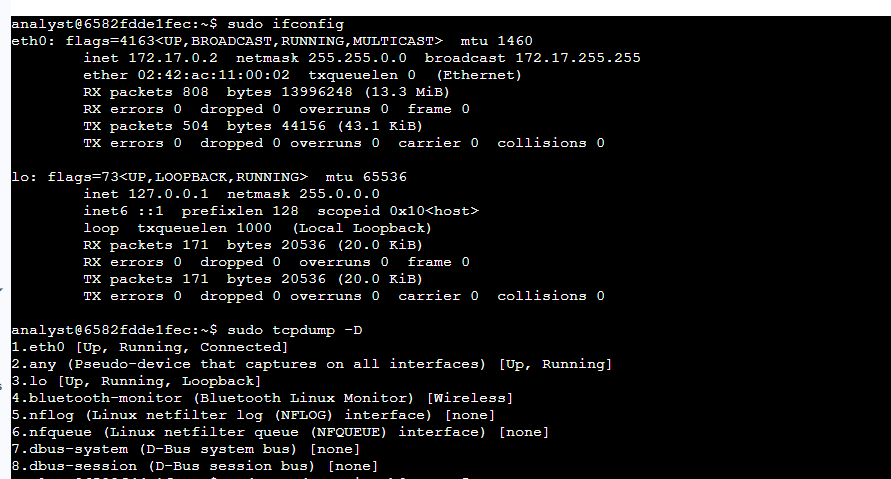
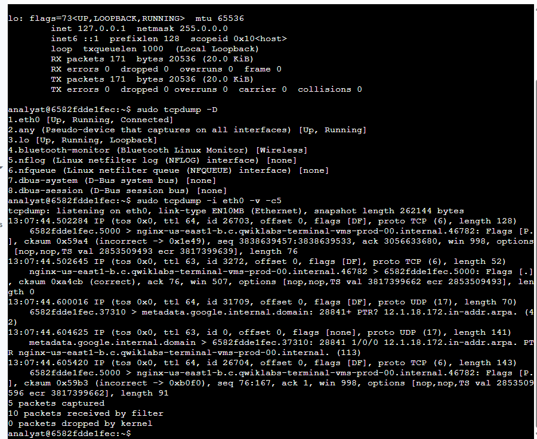
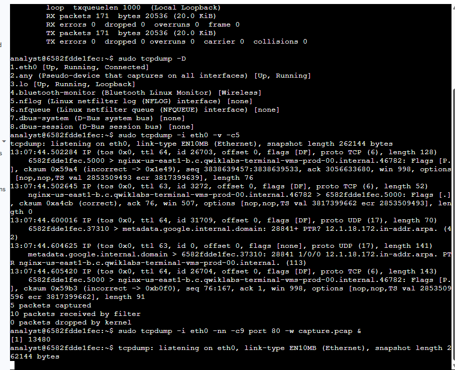
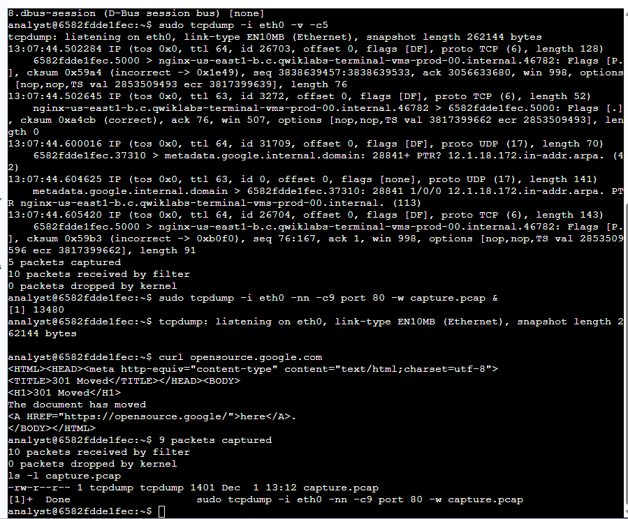
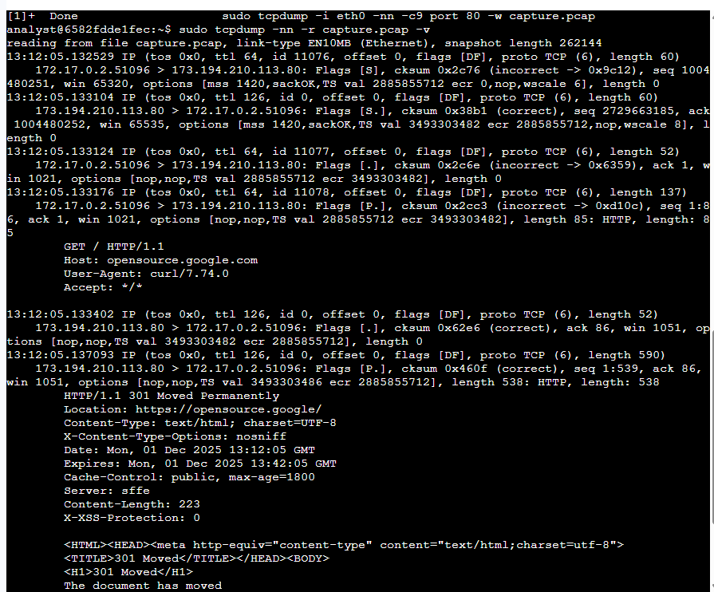
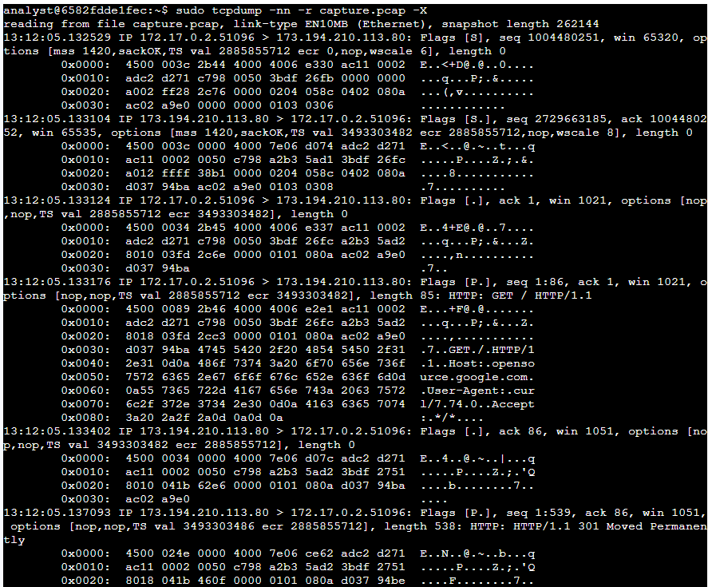

Lab 18: Capturing and Analyzing Network Traffic with tcpdump

Platform: Qwiklabs
Skill Area: Network Analysis, Packet Capture, tcpdump, Traffic Filtering
Date Completed: 01-12-2025
Difficulty: Intermediate

Overview

In this lab, I acted as a network analyst tasked with using tcpdump to capture, filter, and analyze live network traffic from a Linux virtual machine. The environment started with a logged-in user account (analyst) and included a sample packet capture file for analysis toward the end of the exercise.

I completed the lab in four main phases:

1. Identifying active network interfaces

2. Filtering live network traffic with tcpdump

3. Capturing network data into a .pcap file

4. Reading and filtering stored packet data

###Lab Objectives

Through hands-on practice, I learned how to:

Identify available network interfaces using both ifconfig and tcpdump -D

Capture live traffic using tcpdump with interface filters

Interpret tcpdump’s packet output (IP header, flags, sequence numbers, etc.)

Save captured packets into a .pcap file for offline analysis

Use tcpdump to extract detailed header data and full hex/ASCII dumps

Understand the structure and behavior of TCP/IP traffic in real time

🧪 Task 1: Identify Network Interfaces

First, I verified which network interfaces were available using:

sudo ifconfig

This listed standard Linux interfaces, including:

eth0 — primary Ethernet interface

lo — loopback interface

The primary interface used for capturing traffic throughout this lab was eth0.

Next, I used tcpdump to list all available capture interfaces:

sudo tcpdump -D

This is helpful on systems where ifconfig is not available.

✔ Task 1 complete: I verified network interfaces using both ifconfig and tcpdump.

🧪 Task 2: Inspect Live Network Traffic with tcpdump

To capture and display live network traffic from eth0, I ran:

sudo tcpdump -i eth0 -v -c5

Explanation of flags:

-i eth0 — listen only on eth0

-v — verbose packet details

-c5 — stop after 5 packets

The tcpdump output displayed:

Timestamps

Protocol (IP)

IP header attributes (TOS, TTL, ID, flags, protocol, length)

Source and destination hostnames/IPs

Source and destination ports

TCP flags (S, P, ACK, etc.)

Checksums and sequence/ack numbers

Window size and TCP options

This task demonstrated how packet values change between captures depending on network activity.

✔ Task 2 complete: I filtered and analyzed live packet data on the eth0 interface.

🧪 Task 3: Capture Network Traffic to a File

To capture only HTTP (port 80) traffic into a .pcap file, I used:

sudo tcpdump -i eth0 -nn -c9 port 80 -w capture.pcap &

Explanation of flags:

-nn — disable hostname and port resolution (best security practice)

-c9 — capture exactly 9 packets

port 80 — capture only HTTP traffic

-w capture.pcap — write packets to file

& — run tcpdump in the background

To generate port 80 traffic, I ran:

curl opensource.google.com

To verify the capture file:

ls -l capture.pcap

✔ Task 3 complete: The file capture.pcap was successfully created and contained the expected packet data.

🧪 Task 4: Filter Stored Packet Data

I then loaded the previously captured .pcap file with tcpdump to view header details:

sudo tcpdump -nn -r capture.pcap -v

This provided:

IP header details

Source/destination IPs and ports

TCP flags and window sizes

Sequence/ack values

Packet lengths

Next, I examined the hexadecimal and ASCII representation of packet contents using:

sudo tcpdump -nn -r capture.pcap -X

This format is commonly used in:

Malware analysis

Forensic packet inspection

Detecting payload anomalies

✔ Task 4 complete: I successfully filtered, inspected, and decoded packet capture data.

✅ Conclusion

By completing this lab, I gained practical experience in:

Identifying network interfaces on Linux

Using tcpdump to capture and inspect live network traffic

Understanding IP/TCP header information

Saving network traffic to .pcap files

Loading and filtering packet data offline

Interpreting hex/ASCII packet payloads

This provides a strong foundation for real-world network traffic analysis, intrusion detection, and forensic packet inspection.