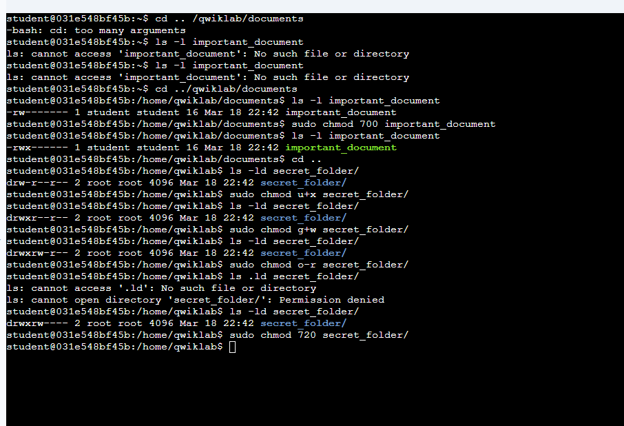
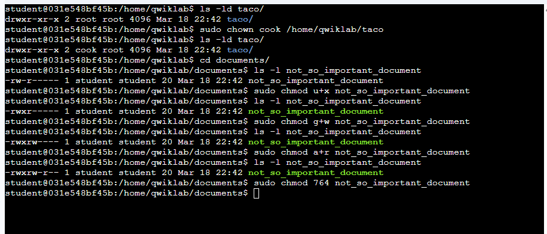
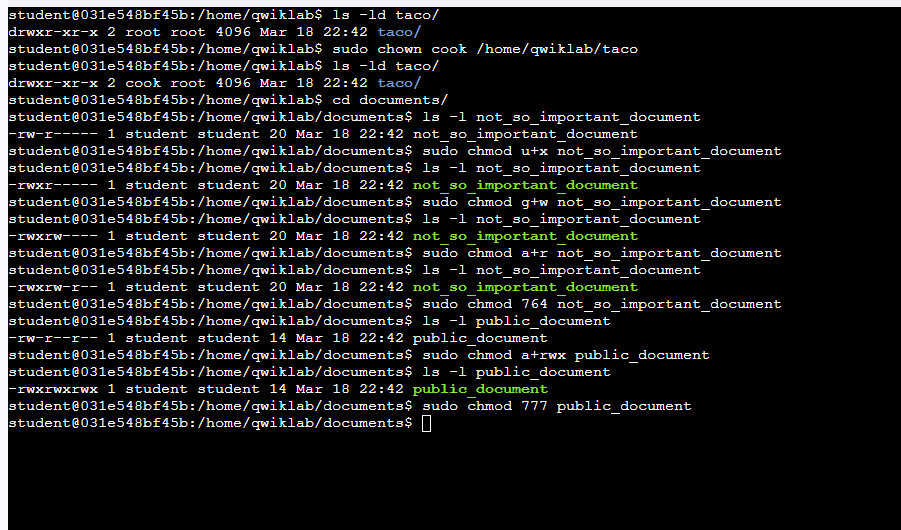

# 🐧 Linux File Permissions Lab

## 📌 Overview
This lab focuses on the fundamentals of managing file and directory permissions in Linux. I practiced inspecting permissions, modifying access levels, and changing ownership using common Linux commands.

The goal is to understand how Linux controls access through:
- User (owner) permissions
- Group permissions
- Others (everyone else)

---

## 🧠 Learning Objectives
- Check file and directory permissions using `ls -l`
- Modify permissions using `chmod` (symbolic & numeric modes)
- Change file ownership using `chown`
- Apply permissions efficiently to meet specific security requirements

---

## 🛠️ Tasks Performed

### 1. Checking & Modifying File Permissions
- Navigated to the `documents` directory
- Inspected permissions of `important_document`
- Updated permissions so only the owner has full access (`700`)

```bash
cd ../qwiklab/documents
ls -l important_document
sudo chmod 700 important_document
```

---

### 2. Modifying Directory Permissions
- Inspected `secret_folder`
- Updated permissions to meet the following criteria:
  - Owner: full permissions
  - Group: write only
  - Others: no permissions

```bash
cd ..
ls -ld secret_folder/
sudo chmod u+x secret_folder/
sudo chmod g+w secret_folder/
sudo chmod g-r secret_folder/
sudo chmod o-r secret_folder/
```

---

## 📸 Screenshots (Tasks 1–2)



---

### 3. Changing Ownership
- Checked ownership of `taco` directory
- Changed owner from `root` to `cook`

```bash
ls -ld taco/
sudo chown cook /home/qwiklab/taco
```

---

### 4. Advanced Permission Configuration
- Modified `not_so_important_document`:
  - Owner: full permissions
  - Group: read + write
  - Others: read only

```bash
cd documents/
ls -l not_so_important_document
sudo chmod u+x not_so_important_document
sudo chmod g+w not_so_important_document
sudo chmod a+r not_so_important_document
```

---

## 📸 Screenshots (Tasks 3–4)



---

### 5. Granting Full Permissions to All Users
- Modified `public_document`
- Granted full access to everyone (`777`)

```bash
ls -l public_document
sudo chmod a+rwx public_document
```

---

## 📸 Final Screenshot



---

## ⚡ Key Commands Summary

| Command | Description |
|--------|------------|
| `ls -l` | View file permissions |
| `chmod` | Change permissions |
| `chown` | Change file owner |
| `u/g/o/a` | User, Group, Others, All |
| `r/w/x` | Read, Write, Execute |

---

## 🧩 Notes
- Numeric permissions:
  - `7 = rwx`
  - `6 = rw-`
  - `5 = r-x`
  - `4 = r--`
- Example:
  - `chmod 700` → Full access for owner only
  - `chmod 777` → Full access for everyone (⚠️ not secure in real systems)

---

## ✅ Conclusion
This lab demonstrates how Linux permission management works in practice. Understanding these concepts is essential for system administration, DevOps, and cybersecurity tasks.