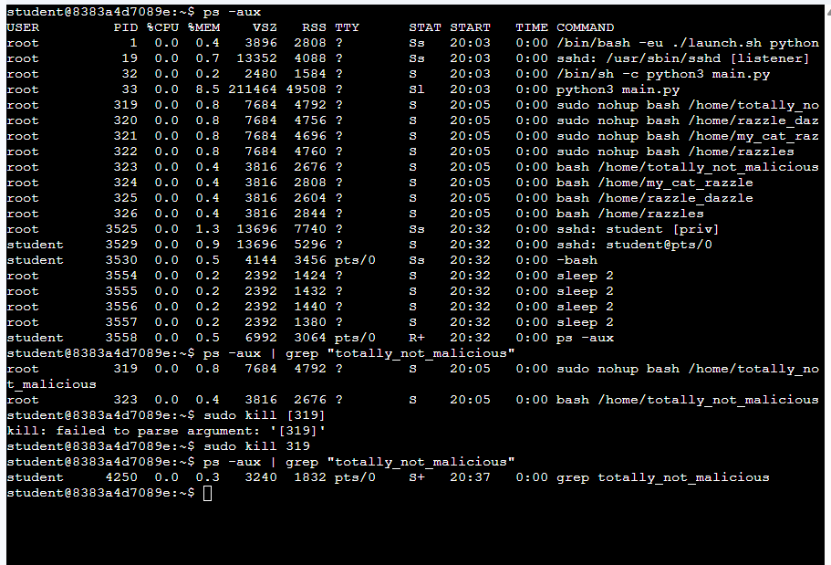
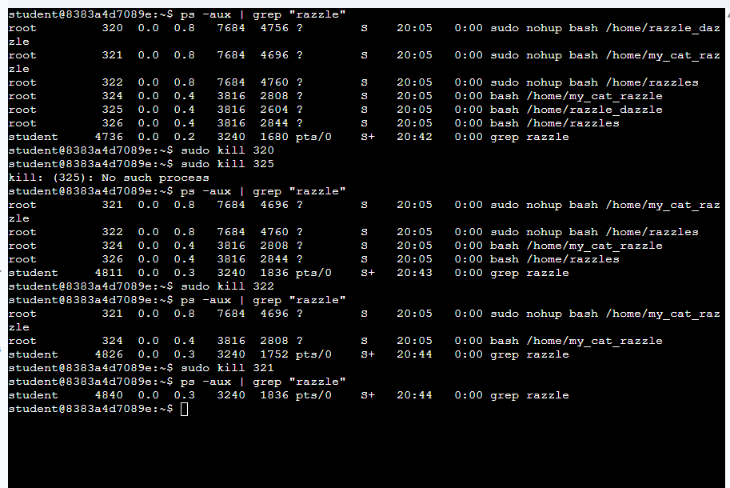

🐧 Maintain Efficient Process Utilization on Linux
📌 Overview

This lab focuses on managing and maintaining running processes in a Linux environment. I practiced identifying specific processes, filtering them using command-line tools, and terminating unwanted or potentially malicious processes.

The goal is to understand how Linux handles processes and how to control them efficiently using:

Process listing commands

Filtering techniques

Process termination tools

🧠 Learning Objectives

List running processes using ps -aux

Filter processes using grep

Identify Process IDs (PIDs)

Terminate processes using kill

Verify that processes have been successfully stopped

🛠️ Tasks Performed
1. Identifying & Terminating a Specific Process

Searched for processes named totally_not_malicious

Identified their Process IDs (PIDs)

Terminated the processes using kill

Verified that the processes were no longer running

ps -aux | grep "totally_not_malicious"
sudo kill [PROCESS_ID]
ps -aux | grep "totally_not_malicious"

2. Terminating Multiple Processes

Searched for processes containing the keyword razzle

Identified all related processes

Ignored the grep process

Terminated each process individually

Verified that all processes were stopped

ps -aux | grep "razzle"
sudo kill [PROCESS_ID]
ps -aux | grep "razzle"

⚡ Key Commands Summary
Command	Description
ps -aux	List all running processes
grep	Filter process output
kill	Terminate a process
sudo	Execute commands with elevated privileges
🧩 Notes

Every running process has a unique PID (Process ID)

grep helps narrow down large outputs when searching for specific processes

Always double-check the PID before using kill to avoid stopping the wrong process

The grep command itself appears in results and should be ignored

✅ Conclusion

This lab demonstrates how to monitor and control processes in Linux. Understanding these concepts is essential for system administration, troubleshooting, and cybersecurity, especially when dealing with unwanted or suspicious processes.