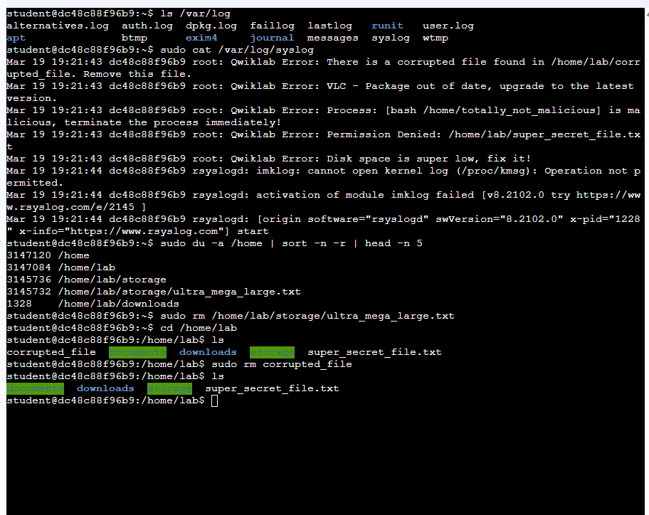
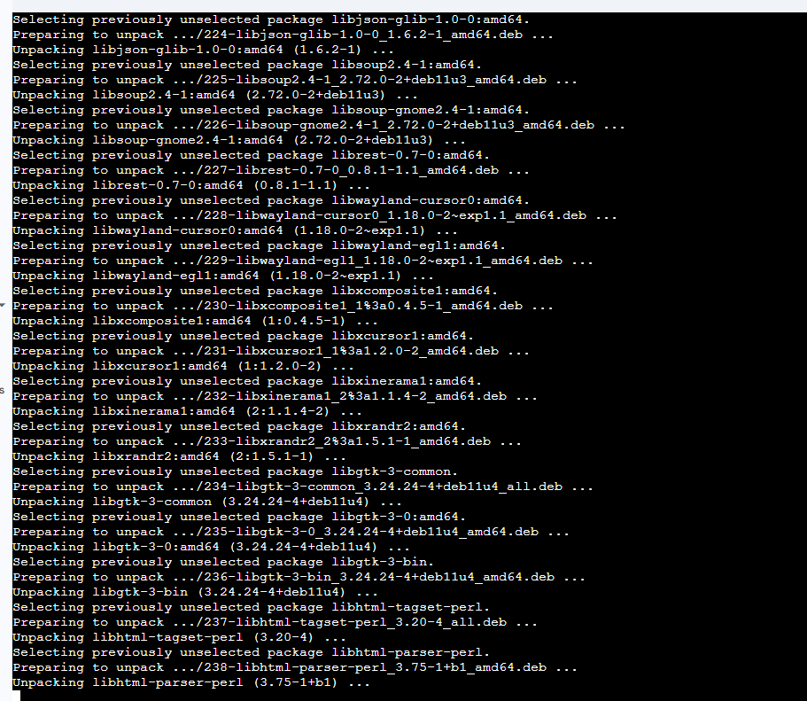
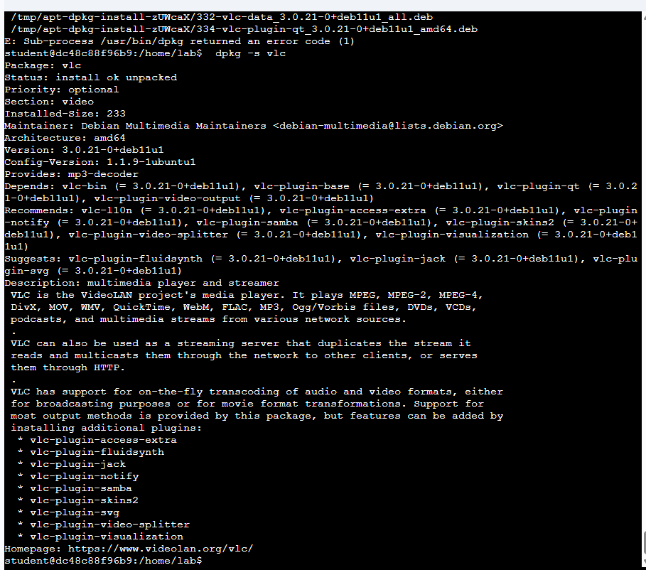
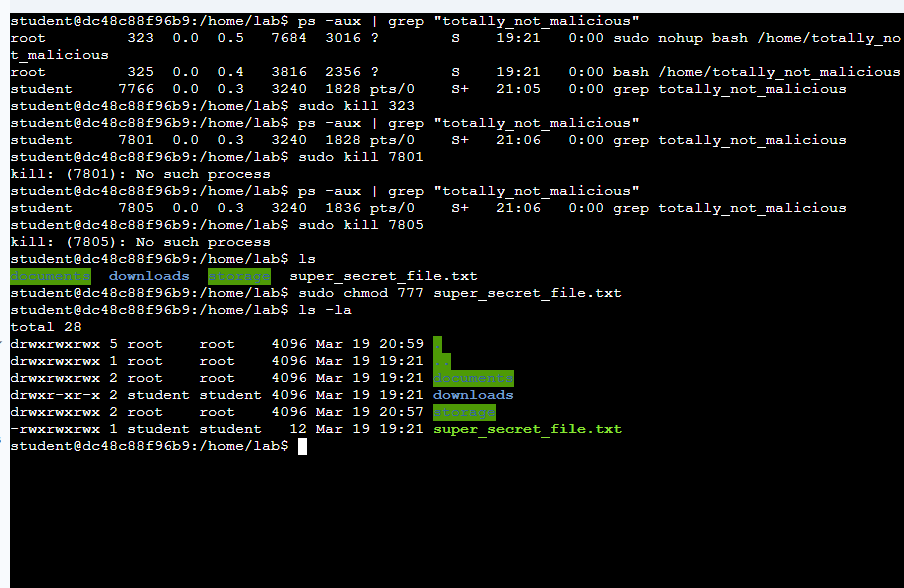

# 🐧 Using Logs to Help You Track Down an Issue in Linux

## 📌 Overview
This lab focuses on troubleshooting system issues in Linux using log files. I analyzed system logs to identify problems and applied previously learned Linux skills to resolve them.

The goal was to understand how to "follow the trail" using logs and fix issues related to:
- Disk space
- Corrupted files
- Software packages
- Running processes
- File permissions

---

## 🧠 Learning Objectives
- Navigate and read system logs in `/var/log`
- Filter logs using `grep`
- Identify issues based on log entries
- Resolve system problems using Linux commands
- Apply knowledge from previous labs in a real troubleshooting scenario

---

## 🛠️ Tasks Performed

### 1. Viewing and Analyzing Logs
- Listed available log files
- Opened and reviewed the system log (`syslog`)
- Filtered relevant entries containing `"Qwiklab Error"`

    ls /var/log  
    sudo cat /var/log/syslog  
    sudo cat /var/log/syslog | grep "Qwiklab Error"

---

### 2. Fixing Low Disk Space Issue
- Identified large files using `du`, `sort`, and `head`
- Located the largest file in `/home`
- Deleted the unnecessary file to free space

    sudo du -a /home | sort -n -r | head -n 5  
    sudo rm /home/lab/storage/ultra_mega_large.txt

---

## 📸 Screenshots (Tasks 1–2)

---

### 3. Removing a Corrupted File
- Navigated to the target directory
- Deleted the corrupted file

    cd /home/lab  
    sudo rm corrupted_file

---

### 4. Updating VLC and Fixing Dependencies
- Fixed broken package dependencies
- Checked the status of the VLC package

    cd ~  
    sudo apt-get install -f  
    dpkg -s vlc

---

## 📸 Screenshots (Tasks 3–4)

---

### 5. Terminating a Malicious Process
- Searched for the `totally_not_malicious` process
- Identified its PID
- Terminated the process and verified

    ps -aux | grep "totally_not_malicious"  
    sudo kill [PROCESS_ID]  
    ps -aux | grep "totally_not_malicious"

---

### 6. Fixing File Permissions
- Updated permissions of `super_secret_file.txt`
- Set permissions to allow full access (777)

    sudo chmod 777 super_secret_file.txt

---

## 📸 Final Screenshot

---

## ⚡ Key Commands Summary

| Command | Description |
|--------|------------|
| `ls /var/log` | List log files |
| `cat` | View file contents |
| `grep` | Filter log entries |
| `du` | Check disk usage |
| `sort` | Sort output |
| `head` | Show top results |
| `rm` | Delete files |
| `apt-get` | Manage packages |
| `dpkg -s` | Check package status |
| `ps -aux` | List processes |
| `kill` | Terminate processes |
| `chmod` | Change file permissions |

---

## 🧩 Notes
- Logs are stored in `/var/log` and are essential for troubleshooting
- The `syslog` file contains system-level messages and errors
- Logs are not removed after fixing issues—they remain for auditing
- Filtering logs with `grep` makes analysis much easier
- Always use `sudo` when performing administrative actions

---

## ✅ Conclusion
This lab demonstrated how to use logs to identify and resolve system issues in Linux. By combining log analysis with practical command-line skills, I was able to troubleshoot multiple problems effectively. This is a critical skill for system administration, IT support, and cybersecurity.