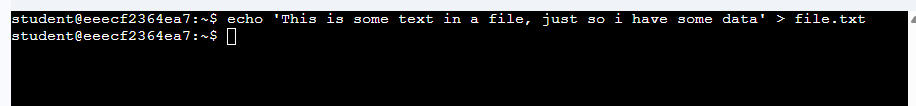
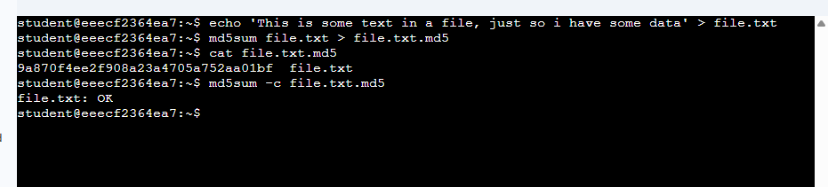
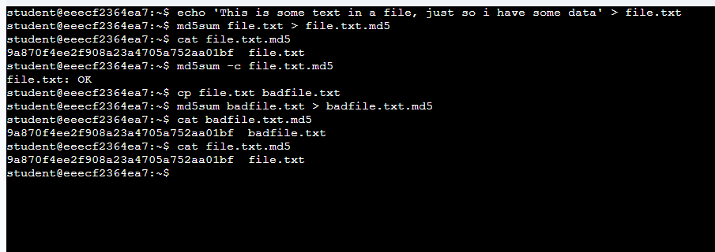
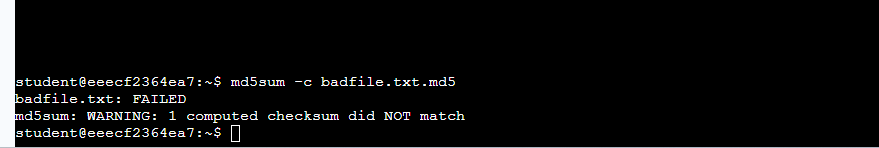
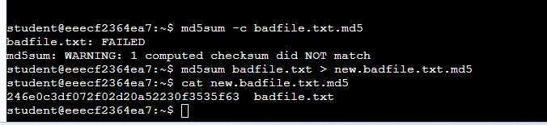
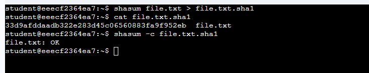
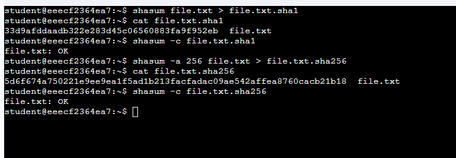

# Hashing Lab – MD5, SHA1, and SHA256

## Overview

In this lab, I learned how to generate and verify **cryptographic hashes** using Linux command line tools.  
The goal was to create a file, generate hash values for it, and verify its integrity using **MD5**, **SHA1**, and **SHA256**.

Hash functions create a unique fixed-length fingerprint of data. Even a very small change to the data will produce a completely different hash value. This makes hashing useful for verifying file integrity and detecting tampering.

---

## 1. Creating a File

To begin the lab, I created a simple text file containing some data that I could use to generate hashes.

I used the following command:

echo 'This is some text in a file, just so we have some data' > file.txt

This command created a file called **file.txt** containing a single line of text. :contentReference[oaicite:0]{index=0}

Create Text File

---

## 2. Generating an MD5 Hash

Next, I generated an **MD5 hash** for the file. A hash is a mathematical representation of the file’s data that can be used later to verify that the file has not been modified.

I generated the hash using:

md5sum file.txt > file.txt.md5

This command calculated the MD5 hash and saved it to a file named **file.txt.md5**. :contentReference[oaicite:1]{index=1}

To view the contents of the hash file, I ran:

cat file.txt.md5

The output displayed a hash value similar to this:

c7a8ef893898f9a6b380eb4ec1e87113  file.txt

To verify that the file had not been modified, I ran:

md5sum -c file.txt.md5

The terminal returned:

file.txt: OK

This confirmed that the file matched the original hash and had not been altered. :contentReference[oaicite:2]{index=2}

MD5 Hash

---

## 3. Demonstrating Hash Failure

Next, I demonstrated how even a tiny change to a file causes the hash verification to fail.

First, I created a copy of the file:

cp file.txt badfile.txt

Then I generated a hash for the copied file:

md5sum badfile.txt > badfile.txt.md5

To inspect the hashes, I used:

cat badfile.txt.md5  
cat file.txt.md5

Both hashes were identical because the contents of the files were still the same. :contentReference[oaicite:3]{index=3}

Next, I edited the copied file using Nano:

nano badfile.txt

Inside the editor, I moved the cursor to the end of the line and added a **single space character**, then saved the file.

Even though this change was extremely small, it modified the file’s contents.

When I verified the hash again using:

md5sum -c badfile.txt.md5

the verification failed and the terminal returned:

badfile.txt: FAILED  
md5sum: WARNING: 1 computed checksum did NOT match

This demonstrated that any change to the data results in a different hash. :contentReference[oaicite:4]{index=4}

MD5 Failure

---

## 4. Recomputing the Hash

To see how much the hash changed after modifying the file, I generated a new MD5 hash for the edited file.

I ran:

md5sum badfile.txt > new.badfile.txt.md5

Then I displayed the new hash:

cat new.badfile.txt.md5

The new hash looked completely different from the original one, even though only a single space had been added to the file.

Example of the new hash:

dcd879fd2c162dbfe9a186a67902e7ce  badfile.txt

Original hash:

c7a8ef893898f9a6b380eb4ec1e87113  file.txt

This demonstrates the **avalanche effect** of hash functions, where even tiny changes drastically alter the hash value. :contentReference[oaicite:5]{index=5}

Recompute MD5Sum

---

## 5. Generating a SHA1 Hash

After working with MD5, I repeated the same process using **SHA1**, which is a stronger hashing algorithm.

To generate a SHA1 hash, I used the command:

shasum file.txt > file.txt.sha1

To view the hash, I ran:

cat file.txt.sha1

Example output:

65639a89992784291d769e05338085d1739645c6  file.txt

To verify the hash, I ran:

shasum -c file.txt.sha1

The terminal returned:

file.txt: OK

This confirmed that the file matched the original SHA1 hash. :contentReference[oaicite:6]{index=6}

SHA1 Hash

---

## 6. Generating a SHA256 Hash

Finally, I generated a **SHA256 hash**, which is currently considered significantly more secure than MD5 or SHA1.

To create the SHA256 hash, I used the following command:

shasum -a 256 file.txt > file.txt.sha256

To display the hash, I ran:

cat file.txt.sha256

The output showed a much longer hash value, for example:

7a54af37c15a82e157c8368324e7234d22778ce845219cd16172895a608030ff  file.txt

The longer hash makes SHA256 much harder to attack or guess compared to older hashing algorithms.

To verify the hash, I ran:

shasum -c file.txt.sha256

The terminal confirmed the integrity of the file. :contentReference[oaicite:7]{index=7}

SHA256 Hash

---

## What I Learned

In this lab, I learned how hashing algorithms are used to verify data integrity.

First, I created a file and generated an **MD5 hash** to create a fingerprint of the file’s contents. I then verified the hash to ensure the file had not been modified.

Next, I demonstrated how even a **single-character change** to a file completely changes the resulting hash and causes verification to fail. This showed how sensitive cryptographic hash functions are to data changes.

Finally, I generated hashes using **SHA1** and **SHA256**, which are stronger algorithms than MD5. I learned that SHA256 produces longer hashes and provides stronger protection against attacks.

Overall, this lab helped me understand how hashing is used in cybersecurity to verify file integrity, detect tampering, and ensure data authenticity.